# Computer Science

This page contains *"under the hood"*  explanations of theoretical concepts of subjects like **Algorithms**, **Data Structures**, **UNIX Operating Systems** and **Computer Networks** (etc...). Several [coding problems](./coding-problems/) were also studied and solved, always including a time and memory complexity analysis. 
<br>
<div>
<p align="center">
  <i>For those who want to have a better understanding on computer science</i>
</p>
</div> 

## Index

1. Computer Architecture
2. [Algorithms and Data Structures](#algorithms-and-data-structures)
    1. [Data Structures](#data-structures)
    2. [Algorithms](#algorithms)
3. Data Bases
4. Operating Systems
5. Computer Networks
6. Parallel Computing
7. Distributed Systems
8. Programming Languages
    1. Java
    2. SQL
    

## Algorithms and Data Structures

An **algorithm** is a sequence of computational steps that transform or analyse the input and generates an output. A **data structure** is a way to store and organize data in order to facilitate access and modifications. When studying algorithms we should keep in mind that computers are not infinitely fast, and memory is inexpensive, but it is not free. Hence, **computing time** and **memory** are bounded resources. Different algorithms that claim to solve the same problem can differ in their efficiency.
Thus we can define the order of growth of an algorithm, which gives a characterization of the algorithm's efficiency. We shall assume that we're using a generic processor, random-access machine, where basic arithmetic instructions (*add*, *subtract*, *multiply*, *divide*, *remainder*, *floor*, *ceiling*), data movement (*load*, *store*, *copy*), and control (conditional and unconditional branch, subroutine call and return) take a **constant** amount of time.  So the ***random-access machine*** model is our model of computation. It specifies what operations can be done in an algorithm and how much they cost. 

### Asymptotic Notation

We can determine the exact running time of an algorithm, but the extra precision is not usually worth the effort of computing it. The constants and lower order terms are dominated by the effect of the input size. We can study the asymptotic efficiency of algorithms when looking at input sizes that are large enough to make only the order of growth of the running time relevant. With **Asymptotic**, we want to say that we look at input sizes large enough to make only the order of growth of
the running time relevant.  Therefore, in that case, we are concerned about **how the running time of the algorithm increases, as the size of the input increases**. Usually, algorithms that are asymptotically more efficient will be the best choice for all but very small inputs. 
* The most common notation is denominated as **Big-O**, and it describes the worst case. It provides an *asymptotic upper bound* for the growth rate of runtime of an algorithm. It can be translated in:
O(g(n)) = <span>&#123;</span> f(n): if there exists positive constants c and n<sub>0</sub> such that 0 <span>&le;</span> `f(n)` <span>&le;</span> `cg(n)` for all n <span>&ge;</span> n<sub>0</sub> <span>&#125;</span>.
* **Big-Omega**, commonly written as Ω, is an asymptotic notation for the best case. It provides the *asymptotic lower bound*  for the growth rate of runtime of an algorithm. It can be translated in:
Ω(g(n)) = <span>&#123;</span> f(n): if there exists positive constants c and n<sub>0</sub> such that 0 <span>&le;</span> `cg(n)` <span>&le;</span> `f(n)` for all n <span>&ge;</span> n<sub>0</sub> <span>&#125;</span>.
* **Theta**, commonly written as Θ, is an Asymptotic Notation to denote the asymptotically tight bound on the growth rate of runtime of an algorithm. This notation asymptotically bounds a function from above and below. It can be translated in:
Θ(g(n)) = <span>&#123;</span> f(n): if there exists positive constants c<sub>1</sub>, c<sub>2</sub> and n<sub>0</sub> such that 0 <span>&le;</span> c<sub>1</sub>`g(n)` <span>&le;</span> `f(n)` <span>&le;</span> c<sub>2</sub>`g(n)` for all n <span>&ge;</span> n<sub>0</sub> <span>&#125;</span>. Which means that g(n) must be Ω(g(n)) and O(g(n)) at the same time. 
* **o-notation** is used to denote an upper bound that is not asymptotically tight. The asymptotic upper bound provided by O-notation may or may not be asymptotically tight. 
* **ω-notation**, similarly to the previous annotation, denotes a lower bound that is not asymptotically tight.

### Data Structures

1. [Arrays](#arrays)
4. [Linked Lists](#linked-lists)
3. [Stacks](#stacks)
4. [Queues](#queues)
5. [Hash Tables](#hash-tables)
6. [Binary Search Trees](#binary-search-trees)
7. [Binary Heaps](#binary-heaps)
8. [Graphs](#graphs)
9. [Fibonacci Heaps](#fibonacci-heaps)
10. van Emde Boas Trees
11. [Disjoint Sets](#disjoint-sets)
12. Segment Trees
13. [Fenwick Trees or Binary Indexed Trees](#fenwick-trees-or-binary-indexed-trees)

#### Arrays

An array is a contiguous region of memory, broken down into elements, indexed by contiguous integers. We can use arithmetic operations to figure out where we want to perform a read or write, hence it is possible to execute these actions in constant time. By looking at the picture below, we can see that in this example, the array is split into elements of 32 bits. Assuming that we're working with a **0-indexed**, we can access the i *-th* element by calculating its address in memory: 
<div>
<p align="center">
    <span>i-th element address = initial address + element size × i</span>
</p>
<br>
<p align="center">
  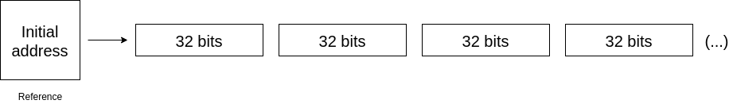
</p>
</div>

A **multi-dimensional** array is formed by an array that contains pointers/references to multiple arrays. Therefore, a *10 by 10* two-dimensional array would contain an array of 10 pointers, to 10 different arrays of size 10. 

<br>

A **resizable array** is a dynamic array that is initialized with **n** elements. This data structure has the ability of shrinking or growing as the number of elements varies.

<br>

**Challenge**: Implement a **generic** resizable array with the following methods:

- [ ] `size()` which retrieves the number of items
- [ ] `capacity()` which retrieves the total capacity
- [ ] `isEmpty()`
- [ ] `get(int index)` which retrieves an element at an arbitrary index, launching an exception if `outOfBounds`
- [ ] `pushBack(T item)`
- [ ] `insert(T item, int index)` 
- [ ] `pop()` which removes the item at the top of the stack and returns its value
- [ ] `delete(int index)`
- [ ] `resize(int newCapacity)` as a private method

The time complexity for adding or removing elements should be **O(n)**, and **O(1)** for the `get(int index)` method. 
The memory complexity should be **O(n)**.

#### Linked Lists

A **Linked List** is a data structure in which the objects are arranged in linear order. How this data structure, however, is completely different. It is not guaranteed that every item is stored in a contiguous block of memory. The order is determined by a pointer in each item. In a ***doubly linked list***, each item should have tow pointer attributes, pointing to the next and previous item. If the pointer to the previous item is `NIL`, then the element has no predecessor and is the first element. On the other hand, if the pointer to the next item is `NIL`, then the element has no successor, and therefore is the last element of the list. 

<div>
<p align="center">
  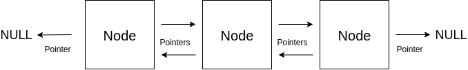
</p>
</div>

A list may have one of several forms. It may be either singly linked our doubly linked, it may be sorted or not, and it may be circular or not. In a ***singly linked list*** we omit the pointer to the previous item in each node. 

<div>
<p align="center">
  
</p>
</div>

A ***circular linked list*** is based on ***doubly linked lists***, with the exception that the pointer to the previous element in the *head* node points to the tail of the list. Following the same idea, the pointer to the next element in the *tail* node points to the head of the list.

<div>
<p align="center">
  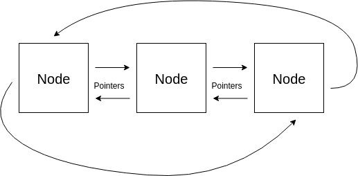
</p>
</div>

Because of the memory architecture of this data structure, we can't perform accesses/searches in O(1). We would have to check every node in the worst case, therefore the time complexity of a search operation is **O(n)**. Since the insert operation attaches the Node to be inserted in the front of the list, then this operation runs in **O(1)**. 
By making use of **Sentinels**, we can simplify our boundary conditions. A ***sentinel*** is a dummy object that points to *head* and *tail* of the list, hence we have a ***circular, doubly linked list with a sentinel***. This change can make the *Linked List* implementation simpler. 

**Challenge**: Implement a singly and doubly LinkedList object. The object should include the following methods:

- [ ] `size()`
- [ ] `isEmpty()`
- [ ] `valueAt(int index)` which retrieves the value of the node
- [ ] `pushFront(T value)`
- [ ] `popFront()`
- [ ] `pushBack(T value)`
- [ ] `popBack()`
- [ ] `head()`
- [ ] `tail()`
- [ ] `remove(int index)`
- [ ] `reverse()`


#### Stacks

In a **stack**, the element deleted is always the one that has been most recently inserted. Therefore, this data structure implements a ***last-in, first-out*** or ***LIFO*** policy. A stack, usually has 2 defined methods. The `insert` operation is often called `PUSH`, and the `delete` operation, which retrieves the element that has been most recently inserted, is called `POP`. Hence, this data structure is an allusion to a real stack, where we remove the top element first. 

<br>

Stacks can be implemented either with a resizable array, or a linked list, where the top elements contain a pointer to the bottom elements. The image bellow is a representation of the second implementation, with 3 elements. 

<div>
<p align="center">
  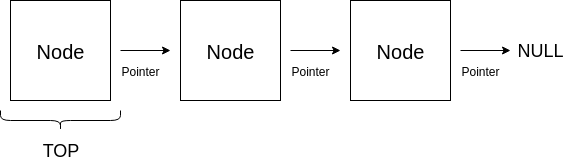
</p>
</div>

<br>

**Challenge**: Implement a stack by making use of the previously implemented **resizable array** object. The implementation should include the following methods:

- [ ] `peek()` which retrieves the item at the top of the stack
- [ ] `empty()`
- [ ] `push(T item)`
- [ ] `pop()` which removes the item at the top of the stack and returns its value

All methods should have a time complexity of **O(1)**. Since we are using a resizable array, the memory complexity should be **O(n)**.

#### Queues

Similarly to the previous section, in a queue, the deleted element is always the one that has been in the set for the longest time: the queue implements a ***first-in, first-out***, or ***FIFO***, policy. The `insert` operation is often called `ENQUEUE`, and the `delete` operation is called `DEQUEUE`. The queue implementation has a **head** and a **tail**, and it can be implemented with a *linked list* or an array (*circular buffer*). The first strategy should include a linked list with a tail pointer. 

**Challenge**: Implement a queue object by following both strategies. The implementation should include the following methods:

- [ ] `enqueue(T item)`
- [ ] `dequeue()`
- [ ] `empty()`
- [ ] `full()` (in the circular buffer implementation)

#### Hash Tables

A ***Hash Table*** is an effective data structure for implementing dictionaries and it supports **three** basic operations: `INSERT`, `SEARCH` and `DELETE`. Although searching in a ***Hash Table*** can take as long as searching for an element in a *Linked List* - *O(n)* - in practice, hashing performs extremely well. Under reasonable assumptions, the average time to search for an element in this data structure is **O(1)**. A ***Hash Table*** directly addresses into an ordinary array, making a good use of the possibility of examining an arbitrary position of the array in **O(1)** time. 

<br>

We can take advantage of direct addressing when we can afford to allocate an array that has one position for every possible key. But this situation is often impractical, as it creates some problems. if the universe U is large, storing a table T of size |U| may be impractical, or even impossible, given the memory available on a typical computer. Furthermore, the set K of keys actually stored may be so small relative to U that most of the space allocated for T would be wasted. With hashing, an element is stored in slot `h(k)`, where **h** is the ***hash function*** of ***k***. Hence, the ***hash function*** maps the universe *U* of keys into the slots of the ***Hash Table*** *T[0...m - 1]*: 

<br>

*h :* <span> U &#8594; &#123;0, 1, ..., m - 1 &#125;</span>

<br>

where the size *m* is typically much less than |*U*|. When an element with key k hashes to slot *h(k)* we also say that *h(k)* is the hash value of key *k*. The hash function reduces the range of array indices and hence the size of the array. Instead of size |*U*|, the array can have size *m*. The previous idea can be represented in the following image.

<div>
<p align="center">
  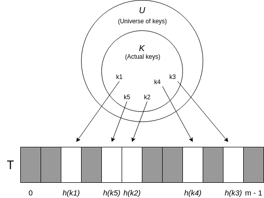
</p>
</div>

However, two keys may hash to the same slot, we call this situation a ***collision***. We can try to avoid collisions altogether by choosing a suitable hash function *h*. One idea is to make *h* appear to be random, but because |*U*| > m, there must be at least to keys that produce the same hash. A well-designed "random"-looking hash function can minimize the number of collisions, but we still need a method for resolving possible collisions. 

##### Chaining 

In ***chaining***, elements with the same hash are inserted into the same *linked list*. We can see a representation in the image bellow. The ***i*** *-th* slot contains a pointer to the head of the list of all stored elements that hash to ***i***. If no elements are stored in ***i***, then it contains `NIL`. Therefore, the running time for insertion is *O(1)* if we assume that the element is not already present in the hash table. If we do want to make sure that this element is not inserted, then the running time is proportional to the length of the list. We can delete an element in *O(1)* time if the lists are doubly linked.

<div>
<p align="center">
  
</p>
</div>

How well does this method work? We can define the ***load factor*** α for *T* as n / m, the average number of elements stored in a chain. The worst-case behaviour of hashing with chaining is terrible: all *n* keys hash to the same slot, creating a list of length *n*. The average case of hashing depends on how well the hash function *h* distributes the entries among m slots. We can make an assumption that a key is equally likely to hash into any of the *m* slots. This assumption is called ***simple uniform hashing***. We are also assuming that the hash function computes in constant time. With such assumptions, successful and unsuccessful searches take an average time of *Θ(1 + α)*. This means that if the number of ***Hash Table*** slots is at least proportional to the number of elements in the table then α = *n* / *m* = *O(1)*. Thus, we can support all operations in O(1) time on average.

##### Hash Functions

A good hash function satisfies the assumption of ***simple uniform hashing***. In practice, we can often employ heuristic techniques to create hash functions that perform well. Qualitative information about the distribution of keys may be useful in this design process. Most hash functions assume that the universe of keys is in the set of natural numbers. If the keys are not natural numbers, then we find a way of interpret them as natural numbers. 

<br>

In the ***division method***, the hash function is, *h(k) = k mod m*, where k is the key that we want to hash. The choice of *m*, which will be the size of the array, is important, and certain values seem to work better. A prime not too close to an exact power of 2 is often a good choice.

<br>

The ***multiplication method*** can be performed in two steps. First, we multiply the key *k* by a constant *A* in the range 0 < *A* < 1 and extract the fractional part of *kA*. Then, we multiply this value by *m* and take the floor of the result. In short, the hash function is the whole part of: *h(k) = m(kA mod <span>2<sup>w</sup></span>) >> <span>2<sup>r- w</sup></span>* where *<span>2<sup>w</sup></span> = m*. An advantage of this method is that the value of *m* is not critical. Even though that this method works "reasonably" well, it works better for some values than others. 

<div>
<p align="center">
  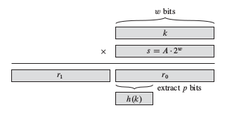
</p>
</div>


***Universal hashing*** consists on choosing the hash function randomly from a set of functions. Because we randomly select the hash function, the algorithm can behave differently even for the same input, guaranteeing good average-case performance for any input. Let ***H*** be a finite collection of hash functions that map a given universe ***U*** of keys into the range *{0, 1, ...., m - 1}*. We call this collection **universal** if for each pair of distinct keys *k, l <span>&#8712;</span> U*, the number of hash functions *h <span>&#8712;</span> H* for which *h(k) = h(l)* is at most *|H| / m*. Which basically means that with a hash function randomly chosen from ***H***, the chance of a collision between distinct keys ***k*** and ***l*** is no more than the chance *1 / m* of a collision if *h(k)* and *h(l)* were randomly and independently chosen from the set *{0, 1, ...., m - 1}*. 

##### Open Addressing

In ***Open Addressing***, all elements are in the table itself. Each table element contains either an element or `NIL`, therefore we avoid pointers and chaining solutions. To perform an insertion we successively ***probe*** the hash table until we find an empty slot. Hence, with ***Open Addressing*** we require that for every key *k*, there's a ***probe sequence***: *{ h(k, 0), h(k, 1), ..., h(k, m - 1) }*. The following list describes the several operations:

- `INSERT(k, v)`: Keep probing until an empty slot is found, and insert item when found.
- `SEARCH(k)`: As long as the encountered slots are occupied by keys *<span>&ne;</span> k*, keep probing until you either encounter *k* or find an empty slot. 
- `DELETE(k)`: Replace item by `DELETED` flag. This flags represents an empty item, but it's not a stop condition for `INSERT` or `SEARCH`.  

There are several types of probing, 

- ***Linear Probing***: *h(k) = (h'(k) + i) mod m*. THis method suffers from a problem known as ***primary clustering***. Long runs of occupied slots build up, increasing the average search time.
- ***Quadratic Probing***: *h(k) = (h'(k) + c<span><sub>1</sub></span>i + c<span><sub>2</sub></span>i<span><sup>2</sup></span>) mod m*, where ***c<span><sub>1</sub></span>*** and ***c<span><sub>2</sub></span>*** are positive auxiliary constants, and ***i*** corresponds to the ***i*** *-th* probe. Therefore, the first hash function corresponds to *h'(k)*. This property leads to a milder form of clustering, called ***secondary clustering***. The initial probe determines the entire sequence, and so only *m* distinct probe sequences are used. 
- ***Double Hashing***: *h(k) = (h<span><sub>1</sub></span>(k) + i h<span><sub>2</sub></span>(k)) mod m*. This methods is one of the bests available for Open Addressing. In this case, the first position is again given by *h<span><sub>1</sub></span>(k)*, and successive probes are offset from previous positions by the amount *h<span><sub>2</sub></span>(k)*, modulo *m*. The probe sequence here depends in two ways upon the key *k*. The value *h<span><sub>2</sub></span>(k)* must be relatively prime to *m*.

##### Perfect Hashing

Hashing offers an excellent *average-case* performance, but the previous cases offer a not so good *worst-case* performance. This scenario can change if the set of keys is ***static***, where we can apply a hashing technique ***Perfect Hashing*** where we can perform a `SEARCH` operation in ***constant time***. The idea is to use ***two levels of hashing***, with universal hashing at each level. The first level is the same as the first level of *hashing with chaining*. We want to hash *n* keys into *m* slots using a hash function *h* selected from a family of universal hash functions. In the second level, we avoid linked list associated with the ***i*** *-th* entry, and we use a small ***secondary hash table*** instead, where we use a second hash function. By choosing this hash function carefully, we can avoid collisions. The size of the secondary hash table is the square of the number of keys hashing to the ***i*** *-th* entry. The choice of squaring this value can be supported by the ***birthday paradox***:

<div style="border-radius: 25px; border: 2px solid gray;">
<p style="margin-top: 13px" align="center">
  If I have n people with <span>n<sup>2</sup></span> possible birthdays, the probability of having 2 people with the same birthday would be 1 / 2
</p>
</div>

<br>

Therefore, we would expect to have less collisions in the second level hash table. The following image contains a representation of ***Perfect Hashing***.

<div>
<p align="center">
  
</p>
</div>


**Challenge**: Implement a hash table with ***Open Addressing***, following a ***linear probing*** strategy.  

- [ ] `hash(K key, int m)`
- [ ] `add(K key, V value)`
- [ ] `get(K key)`
- [ ] `exists(K key)`
- [ ] `remove(K key)`


#### Binary Search Trees

This data structure supports operations including `SEARCH`, `MINIMUM`, `MAXIMUM`, `PREDECESSOR`, `SUCCESSOR`, `INSERT` and `DELETE`. Basic operations take time proportional to the height of the tree. For a complete binary tree, with *n* nodes, such operations run in **O(log n)** time. But if we have a linear chain of nodes, the same operations takes **O(n)** time. We can represent this data structure by a linked data structure in each which each node is an object. These nodes contain more attributes like **left**, **right** and **parent**, that point to the its left and right child node, and its parent node respectively. The root node is the only node whose **parent** is `NULL`. This data structure must always satisfy the ***binary-search-tree property***:

<div style="border-radius: 25px; border: 2px solid gray;">
<p style="margin-top: 13px; margin-right: 15px; margin-left: 15px;" align="center">
  Let <span><b>x</b></span> be a node in a binary search tree. <span><b>y</b></span> is a node in the left subtree of <span><i>x</i></span> if <span>key(<i>y</i>) &le; key(<i>x</i>)</span>. <span><b>y</b></span> is a node in the right subtree of <span><i>x</i></span> if <span>key(<i>y</i>) &ge; key(<i>x</i>)</span> 
</p>
</div> 

<br>

Therefore, a `SEARCH` operation takes **O(h)**, with **h** being the height of the tree. We can define the height of a node, by calculating the longest path of that node to a leaf. If we want to find the node with the smallest key, a.k.a. to perform a `MINIMUM` operation, then we have to successively follow left child pointers. Whereas if we want to the node with the largest key, or perform a `MAXIMUM` operation, then we should follow the right child pointers. These operations also run in **O(h)**. The same happens for the `PREDECESSOR` and `SUCESSOR` operations. 

<br>

The `INSERT` and `DELETE` operations cause the tree to change. Even though that the `INSERT` operation must follow the binary-search-tree property, this operation is relatively straight forward. Handling the `DELETE` operation can be more difficult. Deleting a node **z** from a binary-search-tree **T** has three cases:

- If **z** has no children, then we simply remove it by modifying its parent to replace **z** as `NULL` as its child. 
- If **z** has one child, then we elevate that child to take **z**'s position in the parent node child pointer. 
- If **z** has two children, then we find **z**'s successor ***y***, which must be in **z**'s right subtree, and have ***y*** take **z**'s position in the tree. The rest of **z**'s original right subtree, becomes ***y***'s  new right subtree. **z**'s left subtree becomes ***y***'s new left subtree. 

Both last operations run in **O(h)** time as well. 

**Challenge**: Implement a binary-search-tree with the following functionalities.  

- [ ] `insert(K key)`
- [ ] `exists(K key)`
- [ ] `size()`
- [ ] `min()`
- [ ] `max()`
- [ ] `predecessor(K key)`
- [ ] `successor(K key)`
- [ ] `delete(K key)`

##### AVL trees

A Binary Search Tree is balanced if you can ensure that its height is Θ(log n). AVL trees are balanced, and they ensure it by defining the ***AVL-property***:

<div style="border-radius: 25px; border: 2px solid gray;">
<p style="margin-top: 13px; margin-right: 15px; margin-left: 15px;" align="center">
  AVL trees require heights of left and right children of <b>every</b> node to differ by at most <b>1</b>.
</p>
</div> 

<br>

We can prove that this property ensures that the height of the tree is Θ(log n), and therefore all operations take **O(log n)** time. We can start by supporting this claiming, by defining <span>N<sub>h</sub></span> to be the *minimum number of nodes in an AVL tree of height* ***h***. And therefore:

<div>
<p style="margin-top: 13px; margin-right: 15px; margin-left: 15px;" align="center">
  <span>N<sub>h</sub></span> = 1 + <span>N<sub>h - 1</sub></span> + <span>N<sub>h - 2</sub></span>
</p>
</div> 

by keeping in mind that the ***Fibonacci sequence*** can be defined by, 

<div>
<p style="margin-top: 13px; margin-right: 15px; margin-left: 15px;" align="center">
  <span>F<sub>h</sub></span> = <span>F<sub>h - 1</sub></span> + <span>F<sub>h - 2</sub></span>
</p>
</div> 

we know that,

<div>
<p style="margin-top: 13px; margin-right: 15px; margin-left: 15px;" align="center">
  <span>N<sub>h</sub></span> &gt; <span>F<sub>h</sub></span> and <span>N<sub>h</sub> = n</span> and <span>F<sub>h</sub></span> = <span>&phi;<sup>h</sup> / &radic;5</span>
</p>
</div> 

which means that,

<div>
<p style="margin-top: 13px; margin-right: 15px; margin-left: 15px;" align="center">
  <span>n &gt; &phi;<sup>h</sup> / &radic;5 &hArr; h &lt; log<sub>&phi;</sub>n &hArr; h &lt; 1.44 log n</span>
</p>
</div> 

and therefore the ***height*** of the tree is order of log n.

Therefore, we have to ensure that this property stands every time we `INSERT` or `DELETE` a value in our **Binary Search Tree**. We can achieve that by making use of operations that are denominated as ***rotations***, which take **constant time**. A node can rotate right or left, by changing its pointer structure. A right rotation can be reverted by applying a left operation and vice versa. 

<div>
<p align="center">
  
</p>
</div>

If the ***AVL tree property*** is violated, we know that somewhere in our tree, a node has a left child and right child whose height differs by 2. The simple case comes when both sub nodes are left childs or right childs of their parents, and we can solve the situation by rotating the node of **height 1**.  


<div>
<p align="center">
  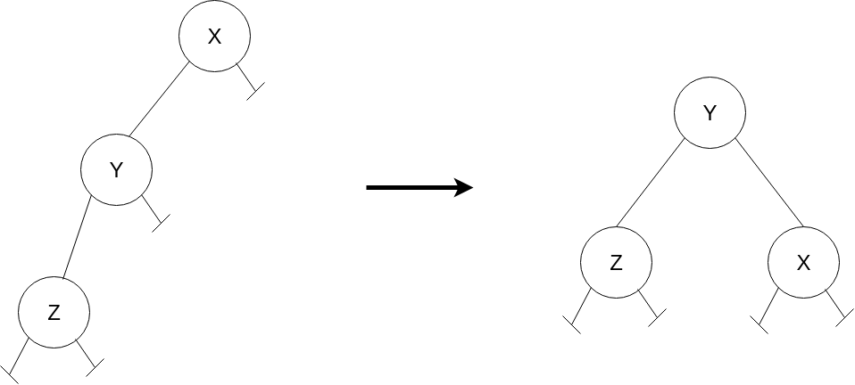
</p>
</div>

Having alternated left, right or right, left childs on the penultimate and last levels creates a peculiar problem, which can be solved by applying a **double-rotation**. This rotation can be followed in the picture below.

<div>
<p align="center">
  
</p>
</div>

**Challenge**: Based on the previously developed binary-search-tree, implement an AVL tree whose insert and delete respect the ***AVL tree property***.  

- [ ] `insert(K key)`
- [ ] `delete(K key)`

##### Red-Black Trees

Similarly to AVL trees, ***Red-Black Trees*** are one of many search trees that are balanced, thus by guaranteeing that their height is of of order ***log n***, they guarantee that basic dynamic-set operations take **O(log n)** time in the worst case. A ***Red-Black Trees*** is a binary search tree with an extra **color** bit per node, which can be *RED* or *BLACK*. By constraining the node colours on any simple path from the root to the leafs, they can make the tree approximately ***balanced***. A red-black tree is a *binary search tree* that satisfies the following properties:

1. Every node is either  <b style="color: #B22222;">red</b> or <b>black</b>.
2. The root is <b>black</b>.
3. Every leaf (NULL) is <b>black</b>.
4. If a node is <b style="color: #B22222;">red</b>, then both its children are <b>black</b>.
5. For each node, all simple paths from the node to descendant leaves contain the same number of <b>black</b> nodes.

For convenience, we use a sentinel to represent `NULL` nodes when dealing with boundary conditions. These nodes are black. We call the number of black nodes on any simple path, from a node **X** down to a leaf, the ***black-height*** of the node. This convention is a notion supported by **property 5**. The ***black-height*** of a ***Red-Black Tree*** is defined by the ***black-height*** of the root node. We shall prove the following claim:

<div style="border-radius: 25px; border: 2px solid gray;">
<p style="margin-top: 13px; margin-right: 15px; margin-left: 15px;" align="center">
  A Red-Black tree with <b>n</b> internal nodes has height of at most <i>2 log (n + 1)</i>
</p>
</div> 


Let's call the ***black-height*** of a node ***h***', and the original height ***h***. We can deduct that, with black nodes only (standing for a valid Red-Black tree), the number of node is of least,

<div>
<p style="margin-top: 13px; margin-right: 15px; margin-left: 15px;" align="center">
  <span>2<sup>h'</sup>-1</span>
</p>
</div> 

This means that,

<div>
<p style="margin-top: 13px; margin-right: 15px; margin-left: 15px;" align="center">
  <span>2<sup>h'</sup>-1 &le; n &hArr; h' &le; log (n + 1)</span>
</p>
</div> 

But because ***property 3***, we know that,

<div>
<p style="margin-top: 13px; margin-right: 15px; margin-left: 15px;" align="center">
  <span>h &le; 2h'</span>
</p>
</div> 

Which implies that,

<div>
<p style="margin-top: 13px; margin-right: 15px; margin-left: 15px;" align="center">
  <span>h / 2 &le; log (n + 1) &hArr; h &le; 2 log (n + 1)</span>
</p>
</div> 

and therefore these trees offer an height function of logarithmic order. As a consequence of this proof, since each operation can run in ***O(h)*** in a binary search tree of height **h**, we can implement the dynamic-set of operations in **O(log n)** time.

To insert a node into an n-node red-black tree, we first insert node ***z*** into the tree ***T*** using the default binary search tree insertion method, and colouring the node with <b style="color: #B22222;">red</b>. To guarantee that the red-black tree properties stand, we use an auxiliary method to recolour nodes our perform rotations. Properties can be violated within 3 different cases:

<div>
<p align="center">
  
</p>
</div>

###### Case 1: x's uncle y is red

In the first case, we've inserted a node **X** with value *b*, which is a child and nephew of a <b style="color: #B22222;">red</b> node. **Property 4** is now being violated.  We can fix it by colouring both ***a*** and ***d*** with <b>black</b>. But because node ***c*** is black, this move violates **property 5**, hence we have to colour node ***c*** with <b style="color: #B22222;">red</b>. Because we've assured that the sub-tree with root ***c*** is now respecting all red-black tree properties, we're going to propagate ***X*** to the upper levels in order to make sure that ***c*** is now respecting these properties as well (not breaking, for example, property 4).

<div>
<p align="center">
  
</p>
</div>

###### Case 2: x's grandparent y is black, and x is a right child

In this case, we could to solve the situation in one step if ***x*** was a left child. Therefore we perform a left rotation of node ***a***, encountering case 3.

<div>
<p align="center">
  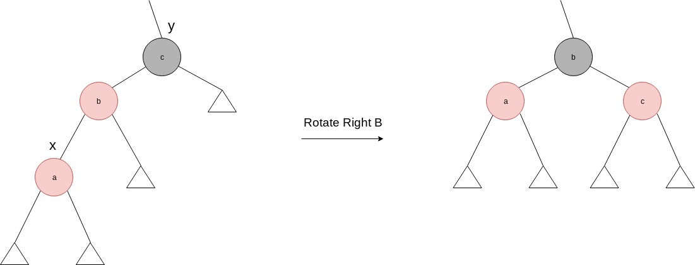
</p>
</div>

###### Case 3: x's grandparent y is black, and x is a right child

Whenever we encounter this case, we are violating *property 5*. We can preserve it by rotating **b** and colouring it <b>black</b>. Followed by colouring both **a** and **c** with <b style="color: #B22222;">red</b>. And since we don't have two <b style="color: #B22222;">red</b> nodes in a row, we've completed the procedure. 


We have to cover the mirrored scenario as well, where we execute the same procedure with **left** and **right** exchanged. Thus, we have three more trivial cases, which follow the idea above. 


The deletion process for red-black trees is a bit more complicated than the insertion process. We proceed with the default binary search tree deletion, and this time we have 4 cases to cover. 

###### Case 1: x's sibling w is red

This situation violates the **5**th property of red-black trees properties. We can switch the colours of ***w*** and ***x's parent***, and then perform a left-rotation on ***x's parent***. Hence, this case is now converted to a case 2, 3 or 4. 

<div>
<p align="center">
  
</p>
</div>

###### Case 2: x’s sibling w is black, and both of w’s children are black

To compensate from removing one black from ***x's parent***, we would like to colour ***w*** red. To compensate from removing one black from ***x*** and ***w*** we have to add an extra black node to ***x's parent***, which can be either <b style="color: #B22222;">red</b> or <b>black</b>. 

<div>
<p align="center">
  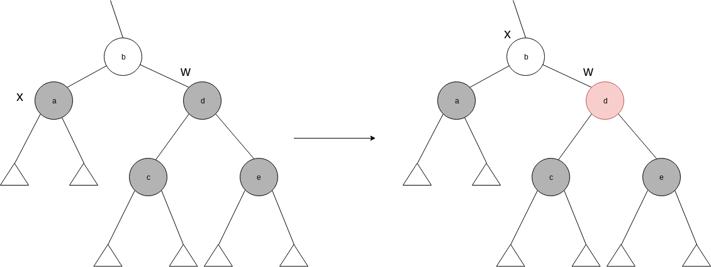
</p>
</div>

###### Case 3: x’s sibling w is black, w’s left child is red, and w’s right child is black

To avoid a property violation, we can switch the colour of ***w*** and its left child, and then perform a *right-rotation* on ***w***. The new sibling ***w*** of ***x*** is now a black node with a red right
child, hence we have transformed case 3 into case 4.

<div>
<p align="center">
  
</p>
</div>

###### Case 4: x’s sibling w is black, and w’s right child is red

By making colour changes and performing a left rotation on ***x's parent*** we can remove the extra black on ***x***.

<div>
<p align="center">
  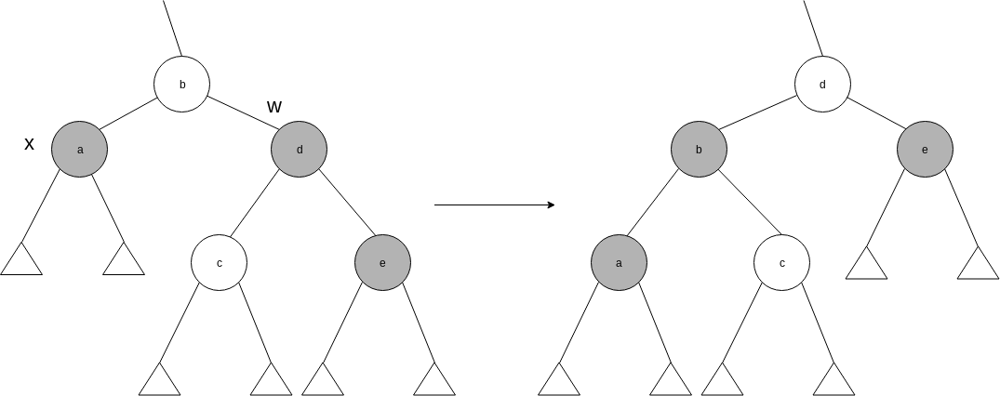
</p>
</div>


**Challenge**: Based on the previously developed binary-search-tree, implement a ***Red-Black tree*** whose insert and delete respect the ***Red-Black tree properties***. 

- [ ] `insert(K key)`
- [ ] `delete(K key)`


#### Binary Heaps

The [heap](#heap) data structure has many uses. In this section we're going to present the most popular application of a heap, an efficient priority queue. ***Priority Queues*** come in two forms, max-priority queues and min-priority queues. We're going to focus on how to implement a max-priority queue. A ***Priority Queue*** is a data structure for maintaining a set of elements associated with a ***key***. It supports the following operations:

- `max()`
- `popMax()`
- `increaseKey(int index, k newKey)` which updates the value of a given key to a new value, assuming that `newKey` is at least as large as the old key.
- `insert(K key)`

By using a heap, we can implement `max` in <i><b>Θ(1)</i></b>, by simply returning the root of the heap. We can then implement `popMax` by returning the root, decreasing the heap size, exchanging the root with the last element and call `maxHeapify` on the new root. The `increaseKey` procedure can be executed increasing the key of a given `index`. This procedure can be followed by exchanging this key with its ***parents*** in case we have a ***heap property violation***, making it run in ***O(log n)*** time. We can then implement `insert`, by simply increasing the heap size, setting the new element to `-∞` and then running increase key on the new element with the correct key. Therefore `insert` runs on ***O(log n)*** time as well.

**Challenge**: Implement a priority queue based on the [heap](#heap) implementation.


#### Graphs

When we characterize the running time of a graph ***G = (V, E)*** we usually denote ***V*** to be the set of vertices and ***E*** the set of edges. Hence, to measure the size of each set, we use ***|V|*** and ***|E|***. Note that we might say that an algorithm runs in *O(V E)*, which corresponds to *O(|V| |E|)*.

We can represent a graph by the ***adjacency-list representation***, which saves an array *Adj* of *|V|* lists, one for each vertex. For each <i>u &in; V</i>, the adjacency list *Adj[u]* contains all the vertices *v* such that there is an edge <i>(u, v) &in; E</i>. Meaning that *Adj[u]* contains all vertices adjacent to *u* in *G*. If *G* is a directed graph, then the sum of lengths of all adjacency list is *|E|*. But if *G* is an undirected graph, then *u* appears in *v*'s adjacency list and vice-versa, therefore the sum of all lengths of adjacency is *2|E|*. In both cases, this representation has a space complexity of <i><b>Θ(V + E)</b></i>. We can also adapt this representation to support ***weighted graphs***. We can store the weight *w(u, v)* of the edge <i>(u, v) &in; E</i> with vertex *v* in *u*'s adjacency list. In a more ***object oriented perspective*** we could store this list inside a *Node* object, without declaring the array. 

For the ***adjacency-matrix representation*** we assume that vertices are numbered from ***0 ... |V|***, and we have a matrix <i>|V| &times; |V|</i>, such that <i>a<sub>i, j</sub></i> contains 1 if <i>(i, j) &in; E</i>, and 0 otherwise. This representation requires <i><b>Θ(V<sup>2</sup>)</b></i>.
You might have an implicit representation as well, where we have `Adj(u)` as a function, that retrieves the list of vertices that are adjacent to vertex *u*.

The following picture contains both ***adjacency-list*** and ***adjacency-matrix*** representations of a ***unweighted*** and ***undirected*** graph.

<div>
<p align="center">
  
</p>
</div>

##### Breadth First Search

Given a graph <i>G = (V, E)</i>, and a source vertex ***s***, breadth-first search systematically explores the edges of *G* to "discover" every vertex that is reachable from ***s***. It computes the distance (smaller number of edges) from *s* to each reachable vertex. Consequently, it produces a "breadth-first tree" with root *s*. Thus, for any vertex *v* that is reachable from *s*, , the simple path in the "breadth-first tree" from *s* to *v* corresponds to the shortest path. This search expands the frontier between discovered and undiscovered vertices uniformly across the breadth of the frontier. The algorithm discovers any vertex at distance ***k*** from *s*, before discovering vertices at distance ***k + 1***. The following snippet includes an implementation in *Java*.

```Java
public void breadthFirstSearch(Node node) {
    Set<Node> visited = new HashSet<>();
    Queue<Node> queue = new LinkedList<>(Arrays.asList(node));
    while (!queue.isEmpty()) {
        Node parent = queue.remove();
        for (Node child : parent.children) {
            if (!visited.contains(child)) {
                visited.add(child);
                queue.add(child);
            }
        }
    }
}
```

In order to analyse this algorithm, we must notice that a *Node* is never enqueued/dequeued more than once, and since these operations run in <i>O(1)</i>, we can also say that the total time of queue related operations take <i>O(V)</i>. This procedure also scans the adjacency list of a given vertex at least once. Since the sum of lengths of adjacency lists is <i>Θ(2E)</i> for undirected graphs and <i>Θ(E)</i> for directed graphs, we have that the running time of this algorithm is <i><b>O(V + E)</i></b>. Thus, it runs in linear time.

This procedure builds a ***breadth-first tree***, that contains an unique simple path from *s* to *v*.

##### Depth First Search

The strategy adapted by this method is, as the name suggests, to go "deeper" in the graph whenever possible. Hence, depth-first search explores edges out of the most recently discovered vertex *v* that still has unexplored edges leaving it. Once all *v*'s edges have been explored, the search backtracks to explore edges leaving the vertex from which ***v*** was discovered. This process continues until we have discovered all the vertices that are reachable from the original source vertex ***s***. Therefore, we can write the algorithm as follows:


```Java
public void depthFirstSearch(Node node) {
    Set<Node> visited = new HashSet<>();
    Stack<Node> stack = new Stack<>();
    stack.push(node);
    while (!stack.empty()) {
        Node parent = stack.pop();
        for (Node child : parent.children) {
            if (!visited.contains(child)) {
                visited.add(child);
                stack.push(child);
            }
        }
    }
}
``` 

We've transformed this algorithm into an iterative one, but we could easily write it by making use of recursion. Notice that if we had a separate node that is not connected to this graph, we would have to iterate through all nodes first in order to perform a complete ***depth-first search***. The running time of this algorithm is still <i><b>O(V + E)</i></b>. An important property of this search is that it has ***parenthesis structure***. Which means that the discovery of vertex ***v*** only finishes after the end of its children discovery. Therefore the discovery of the ***source vertex*** only finishes after discovering every vertex that are reachable from it. 

We can also ***classify the edges*** of the input graph *G = (V, E)*. The type of each edge can be,

1. Tree edge: An edge *(u, v)* is a tree edge if *v* was discovered by exploring the edge *(u, v)*.
2. Back edge: An edge *(u, v)* connecting a vertex *u* to an ancestor *v* in a depth-first tree. Self loops, which may occur in directed graphs, are back edges.
3. Forward edge: An edge *(u, v)* that is connecting a vertex *u* to a descendant *v* in a depth-first tree.
4. Cross edge: An edge *(u, v)* that can go between vertices in the same depth-first tree., as long as one vertex is not descendant of the other.

We now claim that in a depth-first search of an undirected graph *G*, every edge of *G* is either a tree edge or a back edge. Meaning that if *G* has a cycle, then the cycle is formed with a back edge. 

We can also use ***depth-first search*** to perform a topological sort on a *DAG* (Directed Acyclic Graph). A ***topological sort*** of a dag <i>G = (V, E)</i> is a linear ordering of all its vertices such that if *g* contains an edge *(u, v)*, then *u* appears before *v* in the ordering. This property is supported by  *depth-first search* ***parenthesis structure***. Hence, we can use directed acyclic graphs to indicate precedences among events. 

<div>
<p align="center">
  
</p>
</div>


A topological sort of the previous graph corresponds the order of which vertexes are discovered first, this can be useful in job scheduling, for example. The following snippet describes how one could implement this algorithm.

```
TopologicalSort(G):
    call DFS(G)
    add vertex to a linked list as each vertex discovering process comes to an end
    revert linked list order
```  

We can perform a topological sort in time <i><b>Θ(V + E)</b></i>, because we are essentially calling ***depth-first search*** and adding elements to a linked-list, which takes *constant* time. 

#### Fibonacci Heaps

This data structure supports a set of operations that constitutes what is known as a ***mergeable heap***. We can also state that several operations run in ***constant amortized time***. Apart from all operations that we could do in a binary heap, this data structure supports the ***union(h1, h2)*** operation, which creates a returns a new heap containing all elements of *h1* and *h2*. 

<div>
<p align="center">
  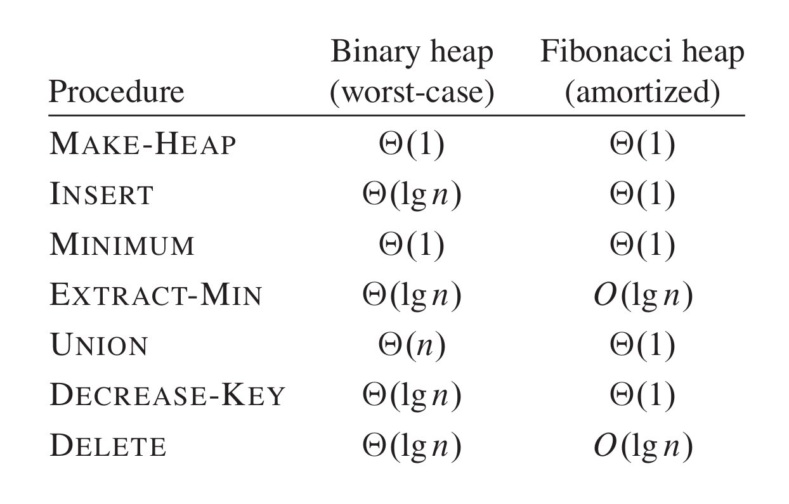
</p>
</div>

From a theoretical point of view, Fibonacci heaps are specially desirable when the number of extract-min and delete operations is small. From a practical point of view however, the programming complexity of this data structure makes it less desirable than regular heaps. Both *binary heaps* and *Fibonacci heaps* are inefficient in how they support the ***search*** operation. Like other data structures that we have seen, Fibonacci Heaps are based on rooted trees. We represent each element as a node within a tree, and each node has a *key* attribute. 

The Fibonacci heap is a collection of rooted trees that are ***min-heap ordered***. 


#### Disjoint Sets

Some applications involve grouping *n* distinct elements into a collection of disjoint sets. These applications often need to perform two operations in particular: finding the unique set that contains a given element and uniting two sets. We will explore how to maintain a data structure that supports these operations. 

The ***disjoint-set*** data structure maintains a collection of <i>S = { S<sub>1</sub>, S<sub>2</sub>, ... S<sub>k</sub> } </i> of disjoint dynamic sets. We can identify each set by a ***representative***, which is some member of the set. Letting ***x*** be a set representative, we want to support the following operations,

- `makeSet(x)`: creates a new set whose only member (and representative) is *x*. Since the sets are disjoint, we require that *x* is in no other set. 
- `union(x, y)`: unites the dynamic sets that contain *x* and *y*, say <i>S<sub>x</sub></i> and <i>S<sub>y</sub></i>, into a new set that is the union of these two sets. Thus, we assume that these two sets are disjoint before the operation. The ***representative*** of the new set is a member of <span>S<sub>x</sub> &cup; S<sub>y</sub></span>. It is common to choose either the representative of <span>S<sub>x</sub> or S<sub>y</sub></span> to be the representative of the new set. Since we require the sets in the collection to be disjoint, we destroy sets <span>S<sub>x</sub> and S<sub>y</sub></span>, removing them from collection ***S***. We often absorb the elements of one of the sets into the other sets.
- `findSet(x)`: returns a pointer to the representative of the (unique) set containing ***x***.

We shall analyse the running times of this data structure in terms of two parameters: ***n***, the number of `makeSet` operations, and ***m***, the total number of all three operations. 

The fastest implementation of disjoint sets, includes a set of rooted trees. Hence, each node represents one member, and each tree represents one set. In a ***disjoint-set forest***, each member points only to its parent. The root of each tree contains the representative, and is its own parent. By introducing two heuristics - ***union by rank*** and ***path compression*** - we can achieve an asymptotically optimal disjoint-set data structure. If, instead, the roots have equal ranks, we arbitrarily choose one of the roots as the parent and increment its rank.


<div>
<p align="center">
  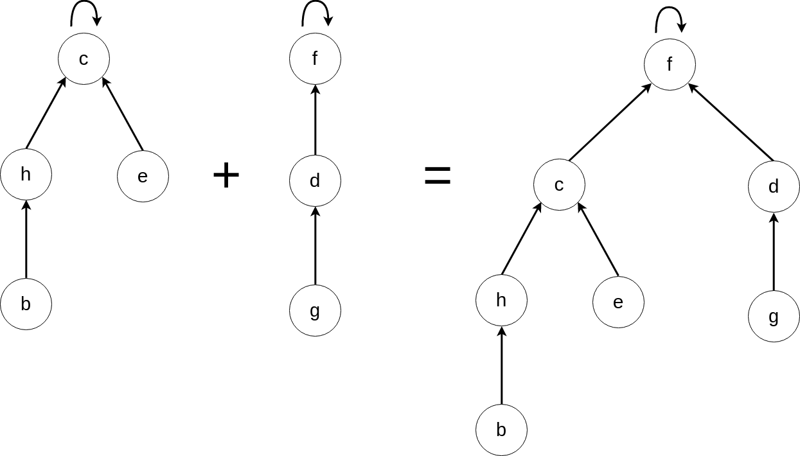
</p>
</div>

We perform the three disjoint sets operations as follows. A `makeSet` operation, that simply creates a tree with just one node. The `findSet` operation by following parent pointers until we find the root of the tree. The nodes constituting this path form the ***find path***. The `union` operation shown in the previous figure, causes the root of one tree pointing to the root of the other tree.

The ***first heuristic*** is called ***union by rank***. The obvious approach would be to make the root of the tree with fewer node point to the root with more nodes. Instead of explicitly keeping track of the size of the sub-tree rooted at each node, we shall use an approach that eases the analysis. For each node, we maintain a ***rank***, which is an upper bound of the weight of that node. In ùnion by rank, we make the root with smaller rank to the root with larger rank during an `union` operation. 

The ***second heuristic***, ***path compression***, is also simple and highly effective. We use it during `findSet` operations to make each node on the find path point directly to the root. Path compression does not change any ranks. The idea can be explained in the image below.

<div>
<p align="center">
  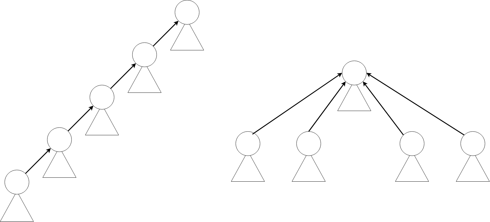
</p>
</div>

In order to implement a ***disjoint-set forest*** with the ***union by rank*** heuristic, we must keep track of ranks. With each node ***x***, we maintain the integer value *x.rank* which is an upper bound on the height of ***x*** (the number of edges in the longest simple path between *x* and a descendant leaf). When `makeSet` creates a singleton set, the single node in the corresponding tree has an initial rank of 0. The `findSet` operation leaves all ranks unchanged. The `union` operation has two cases, depending on whether the roots of the trees have equal ranks. If roots have unequal ranks, we make the root with the higher rank to be representative of the new set, but the ranks themselves remain unchanged. 

```
makeSet(x):
  x.p = x
  x.rank = 0

union(x, y):
  link(findSet(x), findSet(y))

link(x, y):
  if x.rank > y.rank
    y.p = x
  else
    x.p = y
    if x.rank == y.rank
      y.rank = y.rank + 1

findSet(x):
  if x != x.p
    x.p = findSet(x.p)
  return x.p 
```

Separately, both heuristics improve the running time of these operations. The improvement is even greater when we use them together. Alone, union by rank yields a running time of *O(m log n)*. When together, the wors-case running time is <i>O(m &alpha;(n))</i>, where <i>&alpha;(n)</i> is a very slowly growing function. We can view the running time as linear in ***m*** in all practical situations. 


#### Fenwick Trees or Binary Indexed Trees


Fenwick Trees or Binary Indexed Trees **(BITs)** are often known for querying the sum between two indexes in an array in ***O(log n)*** time instead of the naive ***O(n)*** solution. The basic idea is supported by how we can represent number as a sum of powers of two. Let *i* be an index of a *BIT*. Let *r* be the the position of the less significant non-zero digit in binary notation. The value of *tree[i]* holds the sum of values for indices <i>(i - 2<sup>r</sup> + 1)</i> inclusively. In the image bellow, we can see the tree of responsibility of this data structure. Index 16 would have the responsibility of holding the cumulative sum between indexes 0 and 16. On the other hand, index 6 would have the responsibility of holding the sum between 5 and 6. 

<div>
<p align="center">
  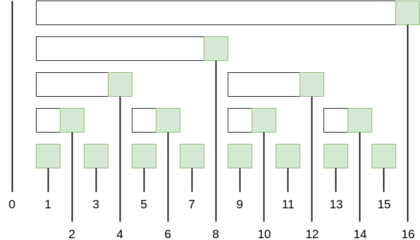
</p>
</div>

The algorithm to initialize this tree requires extracting teh last bit of a number, hence we need an efficient way of accomplish that. Notice that the parent of each element is represented by this value. We can follow a sequence of steps to know what is the parent ***p*** of an index ***j***,

1. Calculate the 2's complement of *j* and save it as *p*.
2. Set *p* to be the logic ***AND*** between *p* and *j*.
3. Set *p* to be the subtraction between *j* and *p*.

We know that the sum between indexes ***[0, j]*** is the sum between node j and every parent in its path. 

```
int getSum(int [] tree, int j) {
  int sum = 0;
  j += 1;
  while (j > 0) {
    sum += tree[j];
    j = j - (j & -j);
  }
  return sum;
}
```

Since this data structure is a ***balanced binnary search tree***, we can perform this operation in ***O(log n)***. We can also update a value by applying a similar logic. We know that only the next elements hold the cumulative sum that include a given index *j*. Therefore we only have to update them.

We can calculate the ***next*** values by,

1. Calculate the 2's complement of *j* and save it as *p*.
2. Set *p* to be the logic ***AND*** between *p* and *j*.
3. Set *p* to be the addition between *j* and *p*.

```
void update(int [] tree, int j, int val) {
  int delta = val - nums[j];
  while (j < tree.length) {
    tree[j] += delta;
    j = j + (j & -j);
  }
}
```

We can create a tree by using dynamic programming. We can use a ***bottom up approach***,

```
int [] initTree(int [] nums) {
  int [] tree = new int[nums.length + 1];
  for (int i = 1; i <= nums.length; i++) {
    update(tree, i, nums[i - 1]);
  }
  return tree;
}
```

The method for creating a ***Binary Indexed Tree*** is bounded by ***O(n log n)***.

### Algorithms

1. [Sorting](#sorting)
2. [Dynamic Programming](#dynamic-programming)
3. [Graph Algorithms](#graph-algorithms)
    1. [Minimum Spanning Trees](#minimum-spanning-trees)
    2. [Single Source Shortest Paths](#single-source-shortest-paths)
    3. [Maximum Flows](#maximum-flows)
4. [Karatsuba Algorithm](#karatsuba-algorithm)
5. [Minimax](#minimax)
6. Pattern Matching
    1. Knuth Morris Pratt
    2. Rabin Karp
7. [NP-Completeness](#np-completeness)


#### Sorting

In this section we're going to come across several algorithms that solve the ***sorting problem***. This methods take a sequence ***a*** of *n* numbers as an input, and they return all elements in the sequence such as <i>a<sub>0</sub> &le; a<sub>1</sub> &le; a<sub>2</sub> &le; a<sub>3</sub> &le; a<sub>4</sub> (...)</i>. The input sequence is usually represented with an array, but we can represent it in a linked list as well.  

##### Insertion Sorting

Starting with insertion sort, it was shown before that this algorithm is an efficient algorithm for handling relatively small inputs. In this algorithm we run through an array from left to right, comparing each element to the elements on the left sub array and inserting it into the correct (sorted) position. This algorithm sorts the input ***in-place***, which means that uses a constant number of stored variables at any time. This sorting method is expected to run in ***Θ(<span>n<sup>2</sup></span>)*** in the worst case, and has a memory complexity of <i>O(1)</i>.

<div>
<p align="center">
  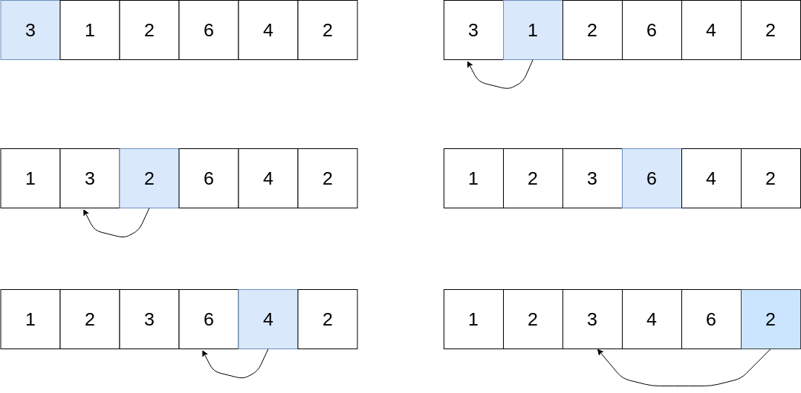
</p>
</div>

**Challenge**: Implement insertion sort. 

- [ ] `insertionSort(T [] array)`


##### Merge Sort

This algorithm follows a ***divide and conquer*** strategy to solve this problem. We start by dividing our sub-domains into two in each step, and then merging each them into the correct order. After reaching to the bottom level (sub-domains with 1 element), we simply pair both sub-domains that were split, inserting elements in the correct order in a new array by executing the "two-finger algorithm". 

<div>
<p align="center">
  
</p>
</div>

By analysing the recurrence tree below, we can clearly see that we have ***1 + log n*** levels with ***n*** elements per level. Hence our algorithm is having an ***C . n*** time complexity per level, and so we have a time complexity of <i>Θ(n log n)</i>. One of the disadvantages of this algorithm when comparing with the previous algorithm is that we don't sort elements in-place, and we create a new sorted array instead, having a memory complexity of <i>Θ(n)</i>. 

<div>
<p align="center">
  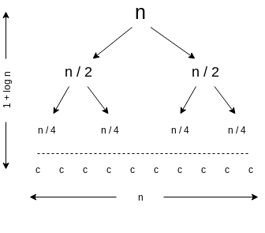
</p>
</div>

**Challenge**: Implement merge sort. 

- [ ] `mergeSort(T [] array)`


##### Heap Sort

We now introduce a new algorithm called ***heap sort***, which sorts elements ***in-place*** and still maintains a running time of <i>O(n log n)</i>. Hence, this sorting technique combines the better attributes of the sorting algorithms that were previously studied. The term ***heap*** was originally coined in the context of heap sort, but nowadays is also referred to be *garbage-collected storage*. We shall refer to this term as the data structure that was initially used in the heap sort. 


The ***heap*** data structure is an array that we can view as a nearly complete binary tree. Each element in the array correspond to a node in the binary tree. This tree is filled in every level except for the lowest, which is filled from the left up to a point. We can define the *heap size* to be the size of the heap, which not necessarily is the size of the array, as we're going to verify later. The root of the tree is given by the element with index ***0***. By giving the index ***i*** of a node, we can compute its parent, left child and right child. We can define the ***height*** of a node to be the longest simple downward path from the node to a leaf.


<div>
<p align="center">
  
</p>
</div>

<br>

- `parent(i) = floor((i - 1) / 2)`
- `right(i) = 2i + 1`
- `left(i) = 2i + 2`

###### Heap

There are two kinds of binary heaps: ***max heaps*** and ***min heaps***, where every node must satisfy the ***heap property***: 

<div style="border-radius: 25px; border: 2px solid gray;">
<p style="margin-top: 13px; margin-right: 15px; margin-left: 15px;" align="center">
  In a <i>max heap</i> the key of a parent is <span>&ge;</span> the keys on its children. In a <i>min heap</i> the key of a parent is <span>&le;</span> the keys on its children.
</p>
</div> 

<br>

Since a heap of ***n*** elements is based on a complete binary tree, its height is <i>Θ(lg n)</i>. Similarly to a balanced binary search tree, basic operations run in <i>O(lg n)</i>. Several basic procedures will be presented, as we will see how they are used in the sorting algorithm and a *priority-queue* data structure. 

- `maxHeapify`, runs in *O(log n)* time and is the key to maintain the heap property. 
- `buildMaxHeap`, runs in *O(n)* time, produces a *max* or *min heap* from an unordered input array.
- `heapsort`, runs in *O(n log n)* time, sorts an array in place.

In order to maintain the the ***heap property*** we define a procedure `maxHeapify`, which receives an index ***i*** of the array as an argument. This method assumes that trees rooted at the childs of this node are max heaps by themselves, but the ***i***-th element of the array might be smaller `A[i]` than its children. In that case, `A[i]` floats down through the heap. At each step, `A[i]` is compared with both its children, and in case of being smaller than one of them, we perform a swap operation between `A[i]` and the children with the greatest key. We then repeat this procedure until `A[i]` is either a leaf, or a root of a *max-heap*. The figure below shows an example of how `maxHeapify` would behave if it was running on node ***i***. The running time of `maxHeapify` on a subtree of size *n* rooted at a given node *i* is *Θ(1)* time to swap elements in case its needed, plus the time to run `maxHeapify` on one of the children's of node *i*. The children's subtrees each have size of at most <i>2 n / 3</i>. Therefore we can describe the running time of `maxHeapify` with a recurrence: *T(n) = T(2n / 3) + Θ(1)*, which is equivalent to be *O(log n)* or *O(h)*.


<div>
<p align="center">
  
</p>
</div>

We now can use the `maxHeapify` method to build a *max heap* with `buildMaxHeap` in a bottom-up manner. We know that the set of elements `A[n/2 ... n - 1]` are all leaves, and therefore the algorithm is pretty straightforward:

```
from i = n / 2 - 1 down to 0:
    do maxHeapify(A, i); 
```

We are now assuring that trees rooted at the children of each node are *max heaps*, because we are running `maxHeapify` on the lower levels first. And therefore we are making sure that each subtree respects the *heap property*. Each call to `maxHeapify` runs in *O(log n)* time, and `buildMaxHeap` makes *O(n)* calls to `maxHeapify`. Hence, the running time of this algorithm is *O(n log n)*. But this running time is an upper bound which is not asymptotically tight. Our tighter analysis will rely on the fact that the tree has height of order *log n*, and at most <i>n / 2<sup>h + 1</sup></i> nodes of any height *h*. Thus, we can express the cost of `buildMaxHeap` as being bounded by:


<div>
<p align="center">
  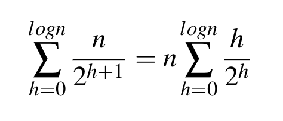
</p>
</div>

which is equivalent to,


<div>
<p align="center">
  
</p>
</div>

And therefore, we can run build a heap from an unordered array in linear time. The heapsort algorithm starts by using `buildMaxHeap` to build a *max-heap* *A[0 ... n - 1]* where *n = A.length*. Since the maximum element is stored at the root, we can put this element in the final position, exchanging *A[0]* with *A[n - 1]*, and consider that the heap has now *n - 1* elements. We should now restore the *max-heap property*, in case it is violated, we can call *maxHeapify* on the root, which leaves a *max-heap* in *A[0 ... n - 2]*. We now repeat this process for the *max-heap* of size ***n - 1*** down to a heap of size ***2***. This algorithm takes time <i><b>O(n log n)</b></i>, since calling `buildMaxHeap` takes <i><b>O(n)</b></i> time, and each of the `maxHeapify` calls takes <i><b>O(log n)</b></i>.

**Challenge**: Implement heap sort. 

- [ ] `maxHeapify(T [] array, int index, int heapSize)`
- [ ] `buildMaxHeap(T [] array, int index, int heapSize)`
- [ ] `heapSort(T [] array)`


##### Quick Sort

Even though that this algorithm has a worst case running time of <i>Θ(n<sup>2</sup>)</i>, quicksort is often the best pratical choice for sorting because it is remarkably efficient on average. Its expected running time is <i>Θ(n log n)</i> and the constant factors hidden in the <i>Θ(n log n)</i> are quite small. With ***quicksort***, we're applying a *divide-and-conquer* process for sorting sub-arrays. 

- **Divide**: We partition the main array *A[p ... r]* into two sub-arrays such that *A[p ... q - 1]* contains elements less or equal to *A[q]* and *A[q + 1 ... r]* contains elements greater or equal than *A[q]*. Compute index *q* as part of this step. 

- **Conquer**: Sort the sub-arrays *A[p ... q - 1]* and *A[q + 1 ... r]* with recursive calls.

- **Combine**: Since the sub-arrays are sorted, no work is needed to combine them, the entire array *A[p .. r]* is now sorted.

We first consider the case when we always choose *A[n - 1]* as pivot. We can then arrange the array ***in-place***, as explained above. The following image can exemplify the general approach to arrange a given array, forming the sub-array of smaller elements (in red), and the sub-array of greater elements (in blue).

<div>
<p align="center">
  
</p>
</div>

The running time of ***quicksort*** depends on whether the partitioning is balanced or unbalanced, which in turn depends on which elements we choose as pivots. 

Therefore, the ***worst-case behaviour*** for quicksort occurs when we obtain one sub-partition with *n - 1* elements and one with *0* elements. We can represent the recurrence for the running time as:

<i>T(n) = T(n - 1) + T(0) + Θ(n)</i>

which intuitively evaluates to <i>Θ(n<sup>2</sup>)</i>. Therefore, if the partitioning is maximally unbalanced at every level, we have a running time of <i>Θ(n<sup>2</sup>)</i>. 

The ***best-case partitioning*** occurs in the most even possible split. If each of the partitions are of size *n / 2*, ***quicksort*** runs much faster. The recurrence for the running time is:

<i>T(n) = 2 &times; T(n / 2) + Θ(n)</i>

which can be translated into <i>Θ(n log n)</i>. Hence, by equally balancing the two sides of the algorithm at every level, we get an asymptotically faster algorithm. 

The ***average-case*** running time of quicksort is much closer to the best case than to the worst case. If we have a recurrence of:

<i>T(n) = T(9 n / 10) + T(n / 10) + cn</i>

we would still reach a **logarithmic** depth of <i>log<sub>10</sub>n = Θ(log n)</i>. The total cost of quicksort would still be <i>O(n log n)</i>. 

However, we can add some randomization to this algorithm by choosing a ***random pivot***, and expect to obtain good performance over all inputs. By following a technique called ***random sampling*** we can randomly select an element from the array to be the pivot. Because we randomly choose the pivot, we expect to split the array reasonably well. 


**Challenge**: Implement quicksort recursively and iteratively.

- [ ] `quicksort(T [] array)`


##### Sorting in linear time 

The previous algorithms were capable of sorting a set of ***n*** numbers in *O(n log n)*, with *merge sort* and *heap sort* achieving this upper bound in the worst case scenario. The sorted order that these algorithms produce is based on comparisons between the input elements, and thus we call them ***comparison sorts***. We shall prove that any comparison sort must make <i><b>Ω(n log n)</b></i> comparisons in the worst case to sort *n* elements. Thus, *merge sort* and *heap sort* are asymptotically optimal, and no comparison sort exist that is faster by more than a constant factor. We are also going to examine three more algorithms that sort in linear time, ***counting sort***, ***radix sort***, and ***bucket sort***. 

<br>

In a comparison sort we only use comparisons between elements in order to sort a sequence. Therefore, given two elements, <i>a<sub>i</sub></i> and <i>a<sub>j</sub></i>, we perform one of the following comparisons: <span><i>a<sub>i</sub></i> = <i>a<sub>j</sub></i>, <i>a<sub>i</sub></i> < <i>a<sub>j</sub></i>, <i>a<sub>i</sub></i> > <i>a<sub>j</sub></i>, <i>a<sub>i</sub></i> &leq; <i>a<sub>j</sub></i>, <i>a<sub>i</sub></i> &geq; <i>a<sub>j</sub></i></span> per step. We can view comparison sorts in terms of ***decision trees***. The image bellow shows a map between concepts.


<div>
<p align="center">
  
</p>
</div>

We shall prove that any comparison sort algorithm requires <i><b>Ω(n log n)</b></i> comparisons in the worst case, by stating that decisions trees are binary, and the number of leafs is at least as big as the number of possible answers, <i>n!</i>. Since a binary tree of height <i>h</i> has no more than <span>2<sup>h</sup></span> leaves, we have:

<i>n! &le; l &le; 2<sup>h</sup></i>,

which by taking logarithms, implies

<i>h &ge; lg(n!) = Ω(n log n)</i>


***Counting Sort*** assumes that each of the input elements is an integer in the range ***0 to k***. This algorithm determines, for each input element **x**, the number of elements less than **x**. It uses this information to place this element directly into the result array. If 17 elements are less than **x**, then **x** belongs in output position 17. You can find this algorithm written in Java bellow,

```Java
public Integer [] countingSort(Integer [] array) {
    /* Find max value */
    int max = 0;
    for (Integer integer : array) {
        if (integer < 0) {
            throw new IllegalArgumentException();
        } else if (integer > max) {
            max = integer;
        }
    }
    Integer [] result = new Integer[array.length], // The result array
        aux = new Integer[max + 1]; // The auxiliary array is filled with 0's following Java's language specs
    for (Integer element : array) {
        aux[element] = 1;
    }
    for (int i = 1; i < aux.length; ++i) { // aux[i] contains the number of elements less or equal than i
        aux[i] += aux[i - 1];
    }
    for (int i = array.length - 1; i >= 0; --i) {
        result[aux[array[i]]] = array[i]; // placing the element in the correct / sorted index
        aux[array[i]]--; // Decrement number of elements before a certain position (useful if we have repeated numbers)
    }
    return result;
}
```

This algorithm beats the lower bound of <i><b>Ω(n log n)</b></i> because it's not a comparison sort. *Counting sort* uses the actual values of the elements to index into an array. Another important property of counting sort is that is stable. Numbers with the same value appear in the output array in the same order as they do in the input array. The property of stability is important when we carry satellite data around with the element being sorted. 

***Radix Sort*** uses counting sort as a subroutine. It recursively sorts numbers on their *least significant* digits first. The process includes to sort number on all ***d*** digits, and remarkably, at that point, the numbers are fully sorted. Hence, we have to perform ***d*** passes through the entire array in order to sort it. 


<div>
<p align="center">
  
</p>
</div>

The analysis of the running time depends on the algorithm used to sort each digit, which has to be stable. When ***d*** is constant and k = O(n), we can make radix sort run in linear time. We can, for instance, sort by  ***bit***. Each pass over ***n*** ***d-digits*** numbers take <i>Θ(n + k)</i>, and since we have ***d*** passes, the total time for radix sort is <i>Θ(d(n + k))</i>.


#### Dynamic Programming


***Dynamic Programming*** is one of my favourites algorithms modules. We can compare it to divide-and-conquer methods that solve problems by combining solutions of sub problems. We apply dynamic programming when sub problems overlap. In this context, divide-and-conquer methods do more work than necessary, solving every sub problem even if it was already solved before. A method whose approach is ***Dynamic Programming*** solves every sub-problem at most once, saving the result and avoiding to recompute the answer every time it solves each sub-problem. We can typically apply dynamic programming to ***optimization problems*** that can have many possible solutions. Each solution has a value and we wish to find the optimal value (minimum or maximum). We can follow a sequence of steps in order to build a dynamic programming algorithm,

1. Characterize the structure of an optimal solution.
2. Recursively define the value of an optimal solution
3. Compute the value of an optimal solution, typically in a bottom-up fashion.
4. Construct an optimal solution from computed information.


We know that we can solve problems of size *n*, by solving smaller problems of the same type, but of smaller sizes. The overall optimal solution can incorporate optimal solutions from sub problems, and therefore we say that this problem has an ***optimal substructure***. We can use ***dynamic programming*** to solve this problem efficiently by saving sub problems solutions, and reuse them when these sub problems overlap. This method uses additional memory, it serves an example of a ***time-memory trade-off***. Hence, we can transform an exponential-time solution into a polynomial-time solution. A ***dynamic programming*** approach runs in polynomial time, when the number of distinct sub problems to be solved is polynomial. 
We usually have two equivalent ways to implement a dynamic programming approach. The first is called ***top-down with memoization***, where we write the procedure recursively in a natural manner, but modified to save the result of each sub-problem (in an array or hash table). The procedure can then check whether the sub problem that is trying to solve was already solved or not, and thus return the saved value if it was. Therefore, the solution to a given sub problem is ***memoized***, as this procedure "remembers" what results it computed previously. The second approach is the ***bottom-up method***, where we sort the sub problems by size, and solve them in size order, smallest first. When solving larger problems, we've already solved all of the smaller sub problems its solution depends on. 


##### Matrix Chain Multiplication

The Matrix Chain Multiplication problem is defined by the product of several matrices. Given a chain of ***n*** matrices <i>{ A<sub>1</sub>, A<sub>2</sub>, A<sub>3</sub>, A<sub>4</sub> .... A<sub>n - 1</sub> }</i> we wish to compute the product of the matrices, following the order in the original chain. Matrix multiplication is associative, hence all multiplications result in the same product. Given a chain of <i>{ A<sub>1</sub>, A<sub>2</sub>, A<sub>3</sub>, A<sub>4</sub> }</i> of four matrices, we can ***fully parenthesize*** the product in five different ways. 

-  <i>( A<sub>1</sub> ( A<sub>2</sub>, ( A<sub>3</sub> A<sub>4</sub> ))) </i>
-  <i>( A<sub>1</sub> (( A<sub>2</sub> A<sub>3</sub> ) A<sub>4</sub> )) </i>
-  <i>(( A<sub>1</sub>  A<sub>2</sub> )( A<sub>3</sub> A<sub>4</sub> )) </i>
-  <i>(( A<sub>1</sub> ( A<sub>2</sub> A<sub>3</sub> )) A<sub>4</sub> ) </i>
-  <i>((( A<sub>1</sub>  A<sub>2</sub> ) A<sub>3</sub> ) A<sub>4</sub> ) </i>

How we parenthesize this chain can have a big impact on the cost of performing the product. Certain multiplications result in smaller matrices, and therefore result in a smaller use of computational resources. In order to multiply tow matrices ***A*** and ***B***, they have to be compatible: the number of columns of ***A*** has to be equal to the number of rows of ***B***. If ***A*** is a <i>p &times; q</i> matrix and ***B*** is a <i>q &times; r </i> matrix, then the resulting matrix ***C*** is of size <i>p &times; r</i>. The time to compute ***C*** is therefore <i>p &times; q &times; r</i>, which corresponds to the number of scalar multiplications to calculate a matrix. Hence we want to ***minimize the number of scalar multiplications***. We can define a fully parenthesized matrix product to be the product of two fully parenthesized matrix sub products, and the split between the two sub products may occur anywhere between <i>k = 1, 2, .... n - 1</i>. Thus, we obtain the recurrence:

<i>P(n) = P(k) . P(n - k)</i>

This recurrence means that for every sub sequence with <i>n &ge; 2</i> we produce two more sub problems, and therefore the recurrence is <i>Ω(n<sup>2</sup>)</i>, which is exponential. Hence, the brute force strategy is poor. Because this problem has an ***Optimal Substructure*** we can solve all sub problems the same way we would solve the original problem, and thus we have,

```Python
for k in range (i + 1 .. j):
  DP(i, j) = min(DP(i, k) + DP(k + 1, j) + costOf(A(i, k) . B(k, j))) 
``` 

Observe that the number of overlapping sub problems is large, and therefore we have relatively few distinct sub problems.  We can see how sub problems overlap in the image bellow, which takes as an example the same chain of 4 matrices. This property of overlapping sub problems is the second hallmark of when dynamic programming applies (the first hallmark being optimal substructure). Whenever a problem exhibits optimal substructure, we have a good clue that dynamic programming might apply.

<div>
<p align="center">
  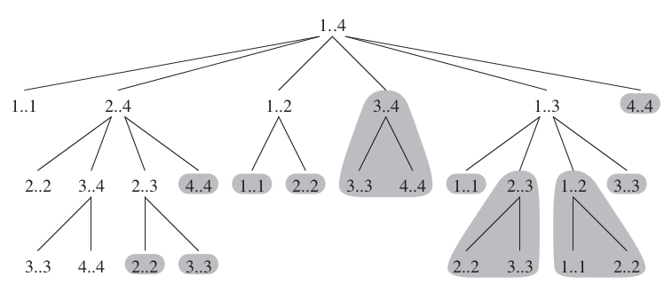
</p>
</div>

##### Longest Common Sub-sequence

A sub sequence of a given sequence is the given sequence with zero or more elements left out. Given a sequence <i>X = { x<sub>1</sub>, x<sub>2</sub> ... x<sub>m</sub> }</i> and <i>Y = { y<sub>1</sub>, y<sub>2</sub> ... y<sub>k</sub> }</i>, we say that a common subsequence exists if exists a strictly increasing sequence of indices where <i>x<sub>i</sub> = y<sub>j</sub></i>. For example, if <i>X = { A, B, C, B, D, A, B }</i> and <i>Y = { B, D, C, A, B, A }</i>, the sequence <i>{ B, C, A }</i> is a ***common sub sequence***. In the  ***longest common sub sequence problem***, we are given two sequences and wish to find a maximum-length common sub sequence of *X* and *Y*. 


In a brute-force approach, we would enumerate all sub sequences of *X* and check if it is also a sub sequence of *Y*, keeping track of the longest sub sequence we could find. Because *X* has <span>2<sup>m</sup></span> sub sequences, this approach requires exponential time. But lets find an ***optimal sub structure*** in this problem, with <i>Z = { z<sub>1</sub>, z<sub>2</sub> ... z<sub>k</sub> }</i> being any common sub sequence of *X* and *Y*. 

1. If <i>x<sub>m</sub> = y<sub>n</sub></i>, then <i>z<sub>k</sub> = x<sub>m</sub> = y<sub>n</sub></i> and <i>Z<sub>k - 1</sub></i> is an LCS of <i>X<sub>m - 1</sub></i> and <i>Y<sub>n - 1</sub></i>.
2. If <i>x<sub>m</sub> &ne; y<sub>n</sub></i>, then <i>z<sub>k</sub> &ne; x<sub>m</sub></i> implies that <i>Z</i> is an LCS of <i>X<sub>m - 1</sub></i> and <i>Y</i>.
3. If <i>x<sub>m</sub> &ne; y<sub>n</sub></i>, then <i>z<sub>k</sub> &ne; y<sub>n</sub></i> implies that <i>Z</i> is an LCS of <i>X</i> and <i>Y<sub>n - 1</sub></i>.

Let us now define a recurrence to this problem. We can first declare <i>length[i, j]</i> to be the length of a common sequence of <i><b>X<sub>i</sub></b></i> and <i><b>Y<sub>j</sub></b></i>. If <i>i = 0</i> or <i>j = 0</i>, one of the sequences has length 0, and so the ***common sub sequence*** would have length 0.  

<div>
<p align="center">
  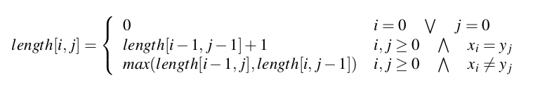
</p>
</div>

The following snippet of code solves this problem in <i>Θ(nm)</i> time, using a memory complexity of <i>Θ(nm)</i> as well. Even though that this procedure returns the length of the longest common sub sequence, we could easily find what are the elements of that sequence maintaining the same asymptotic factors. 

```Java
public int longestCommonSubsequence(T [] x, T [] y) {
    Integer [][] length = new Integer[x.length][y.length];
    for (int i = 0; i < x.length; ++i) {
        length[i][0] = 0;
    }
    for (int j = 0; j < y.length; ++j) {
        length[0][j] = 0;
    }
    for (int i = 1; i < x.length; ++i) {
        for (int j = 0; j < y.length; ++j) {
            if (x[i].equals(y[j])) {
                length[i][j] = length[i - 1][j - 1] + 1;
            } else {
                length[i][j] = Math.max(length[i - 1][j], length[i][j - 1]);
            }
        }
    }
    return length[x.length - 1][y.length - 1];
}
```

The following table can represent the final state of `length`, including the longest common subsequence of both sequences. 

<div>
<p align="center">
  
</p>
</div>


##### Optimal binary search trees

We need an ***Optimal Binary Search Tree*** whenever we want to design a program to translate sentences or find synonyms of words. Because we will search the tree for each individual word in the text, we want the total time spent searching to be as low as possible. We also want to place frequent words nearer to the root, in order to "reward" their lookups. We are given a sequence <i>K = { k<sub>1</sub>, k<sub>2</sub>, k<sub>3</sub> ... k<sub>n</sub> } </i> of *n* distinct keys in sorted order, and we wish to build a binary search tree from these keys. For each <i>k<sub>i</sub></i>, we have probability <i>p<sub>i</sub></i> that a search will occur for <i>k<sub>i</sub></i>. Some searches may occur for keys that are not in <i>K</i>, hence we have to be capable of handling such cases. Therefore, we have that,

<div>
<p align="center">
  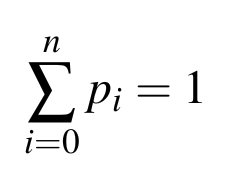
</p>
</div>

and we can define the search cost of the binary search tree as,

<div>
<p align="center">
  
</p>
</div>

Therefore, given a set of keys and probabilities, we wish to construct a binary search tree whose expected search cost is smallest. We call this tree an ***optimal binary search tree***. This condition doesn't mean that we have to construct a tree whose overall height is smallest. Nor that we have to place the key with highest probability on the root. We want to exhaustive check all the possibilities, and because we would have to examine an exponential number of binary search trees, it is difficult to come up with an efficient algorithm. Not surprisingly, we shall solve this problem with ***dynamic programming***. 


In order to *"maintain"* the structure of a binary search tree, we shall keep our keys in a sorted array with *n* elements. We should then search for the optimal root with index <i>k<sub>r</sub></i> <span>&#8712;</span> <i>{ k<sub>i</sub> ... k<sub>j</sub> }</i> (between index *i* and index *j*). Notice that in the first iteration *i = 0* and *j = n - 1*. Because we know that the left sub tree must be rooted between <i>{ k<sub>i</sub> ... k<sub>r - 1</sub> }</i> we can repeat the same procedure of finding the next root between that set of elements. Keep in mind that we can execute the same procedure in the right sub tree,  <i>{ k<sub>r + 1</sub> ... k<sub>j</sub> }</i>.  Because we know that we are trying to obtain the optimal solution in each level, we also know that our problem has an optimal substructure. We also know that some sub problems will overlap, and therefore we can memorize its solution so that we don't have to solve them again. 

***Problem:*** Given a set of words, and its number of appearances in a sufficiently big sample text, we want to build an optimal binary search tree:

```Java
keys = { "rate", "percentage", "fatality", "casualty", "quotas" }
appearances = { 5, 2, 1, 3, 1 }
```

We can first define a ***Node*** that will keep information structured,

```Java
class Node<T> {
    T key;
    int appearances;
    Node(T key, int appearances) {
        if (this.appearances <= 0) {
            throw new IllegalArgumentException();
        }
        this.key = key;
        this.appearances = appearances;
    }
    @Override
    public int compareTo(Node node) {
        return key.compareTo(node.key);
    }
}
```

Hence, we create a new array of nodes, making it easier to sort these nodes by key, and keep every number of appearances along. The next step is to create two auxiliary matrices that will keep track of every optimal cost, and optimal root from ***i*** to ***j***.

```Java
costs = new Double[nodes.length][nodes.length];
roots = new Integer[nodes.length][nodes.length];

```

After initializing the `costs` matrix elements with <span>+&infin;</span> and `roots` matrix elements with an `UNDEFINED` flag, we can build our tree with ***dynamic programming***,

```Java
private double buildTree(int i, int j, int level) {
    if (roots[i][j] != UNDEFINED) {
        return costs[i][j];
    } else if (i == j) {
        return nodes[i].appearances * Math.log(level);
    }
    for (int r = i; r <= j; r++) {
        double candidateCost = buildTree(i, r - 1, level + 1) +
                buildTree(r + 1, j, level + 1) + nodes[r].appearances * Math.log(level);
        if (candidateCost < costs[i][j]) {
            costs[i][j] = candidateCost;
            roots[i][j] = r;
        }
    }
    return costs[i][j];
}
```

At this point it is obvious that the index of the root of our tree is at `r = roots[0][n - 1]`, and the root of its left sub tree is at `roots[0][r - 1]`. Similarly the root of its right sub tree is at `roots[r + 1][n - 1]`. That being said, it is now easy to find the next sub trees. ***Search operations*** can now be made with a similar strategy to the one found in binary search trees, comparing only keys. These searches have a time complexity of <i><b>O(log h)</b></i> with ***h*** being the height of the new optimal binary search tree.


**Challenge**: Implement a method (following three approaches *recursive*, *top-down* and *bottom-up*) that returns the i-<i>th</i> number of the Fibonacci sequence. The first strategy must not use dynamic programming. Solve the ***string edit distance*** problem by using the same three strategies.

- [ ] `recursiveFib(int i)`
- [ ] `topDownFib(int i)`
- [ ] `bottomUpFib(int i)`
- [ ] `recursiveEditDist(String a, String b)`
- [ ] `topDownEditDist(String a, String b)`
- [ ] `bottomUpEditDist(String a, String b)`

#### Graph Algorithms

##### Minimum Spanning Trees

Let us have a connected and undirected graph <i>G = (V, E)</i>. For each edge <i>(u, v) &in; E</i>, we have a weight <i>w(u, v)</i>. We then wish to find an acyclic **subset** that connects all of the vertices and whose total weight <i><b>w(T) = &sum; w(u, v)</i></b> is minimized. We shall examine two algorithms to solve this problem: ***Kruskal's and Prim's***. These algorithms can be easily implemented by using *binary heaps*, but their run-time complexity can be improved when using ***fibonacci heaps***. The two algorithms are greedy, making the choice that is best at each moment. 

The generic algorithm to solve this problem consists on growing an edge <i>(u, v)</i> that we can add to <i>A</i> without violating the invariant, in the sense that <i>A &cup; { (u, v) }</i> is also a subset of a minimum spanning tree. Such edge is called ***safe edge***, since it maintains the invariant. 


```
MinSpanningTree(G(V, E, W)):
  A = {}
  while A is not a spanning tree:
    find a safe edge (u, v) for A
    A = A U { (u, v) }
  return A
```

The process that varies is, of course, the process of finding a ***safe edge***. Let us first define some concepts: A ***cut*** (S, V - S) of an undirected graph <i>G = (V, E)</i> is a partition of <i><b>V</b></i>. We say that an edge <i>(u, v) &in; E</i> ***crosses*** the cut <i>(S, V - S)</i> if one of its endpoints is in <i>S</i> and the other is <i>(V - S)</i>. We say that a cut ***respects*** a set <i>A</i> of edges if no edge <i>A</i> crosses the cut. An edge is a ***light edge*** crossing a cut if its weight is the minimum of any edge crossing the cut. 

###### Kruskal's algorithm

This algorithm finds a safe edge to add to a given growing forest by finding, of all edges, an edge <i>(u, v)</i> of least weight. 

```
Kruskal(G(V, E, W)):
  A = {}
  sort edges into non-decreasing order by weight
  for each edge (u, v) previously sorted:
    if u and v are not in the same subtree:
      match u and v
      A = A U { (u, v) }
```

<div>
<p align="center">
  
</p>
</div>

The running time of this algorithm depends on how we implement each data structure, but we can do it in <i><b>O(E log V)</i></b> time. 

###### Prim's algorithm

This algorithm is very similar to the Dijkstra algorithm for finding shortest paths in a graph. It has the property that the edges on set ***A*** always form a single tree. Each step it adds a light edge that connects ***A*** to a given vertex <i>v &notin; A</i>.  

```
Prim(G(V, E, W), root):
  for each v in V:
    v.key = ∞
    v.π = -1
  root.key = 0
  Q = V
  while Q != {}:
    u = extractMin(Q)
    for each v in AdjList(u):
      if v in Q and w(u, v) < v.key:
        v.key = w(u, v)
        v.π = u
```

<div>
<p align="center">
  
</p>
</div>

Using a fibonacci heap, we can make this algorithm time complexity <i><b>O(E  + V log V)</i></b>.

##### Shortest Paths

In a single source shortest path problem, we are given a weighted, directed graph *G = (V, E)*, with a weight function  <i>w : E &in; R</i>, mapping edges to real-valued weights. The ***weight*** *w(p)* of a path <i>P = {v<sub>0</sub>, v<sub>1</sub>, .... , v<sub>k</sub>}</i> is given as the sum of weights of its edges.

<div>
<p align="center">
  
</p>
</div>


 We define the **shortest-path** <i> &delta;(u, v) </i> from *u* to *v* by,


<div>
<p align="center">
  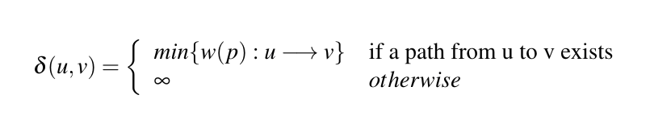
</p>
</div>

We shall first focus on the **single-source shortest-path problem**. Given a graph <i>G = (V, E)</i>, we want to find a shortest path from a given source vertex. We have several variances for this problem, we can define them as,

- **Single-destination shortest-paths problem:** Find a shortest path to a given ***destination*** vertex *t* from each vertex *v*. By reversing the direction of each edge in the graph, we can reduce this problem to a single-source problem. 

- **Single-pair shortest-path problem:** Find a shortest path from *u* to *v* for given vertices *u* and *v*. If we solve the single-source problem with source vertex *u*, we solve this problem also. Moreover, all known algorithms for this problem have the same worst-case asymptotic running time as the best single-source algorithms.

- **All-pairs shortest paths problems** Find a shortest path from *u* to *v* for every pair of vertices *u* and *v*. Although we can solve this problem by running a single source algorithm once from each vertex, we usually can solve it faster. 

Shortest-paths algorithms rely on the fact that a shortest path is composed by several shortest paths. Therefore we have an optimal-substructure, which is a key indicator of dynamic programming. ***Djikstra*** algorithm is a greedy method, and ***Floyd-Warshal*** algorithm, which finds shortest paths between all pairs of vertices is a dynamic-programming algorithm. 

Some instances of this problem may include edges whose weight are ***negative***. If the graph <i>G = (V, E)</i> contains no negative weight cycles reachable from the source *s*, then for all <i>v &in; V</i>, the shortest-path weight, <i>&delta;(s, v)</i> remains well defined. If the graph contains a negative weight cycle, then shortest-path weights are not well defined. No path from *s* to a vertex can be shortest-path, because we can always find a path with a lower weight. The image below contains a graph with a negative cycle. The path between vertices *i*, *j* and *h* is also a negative cycle. Notice that the 

<div>
<p align="center">
  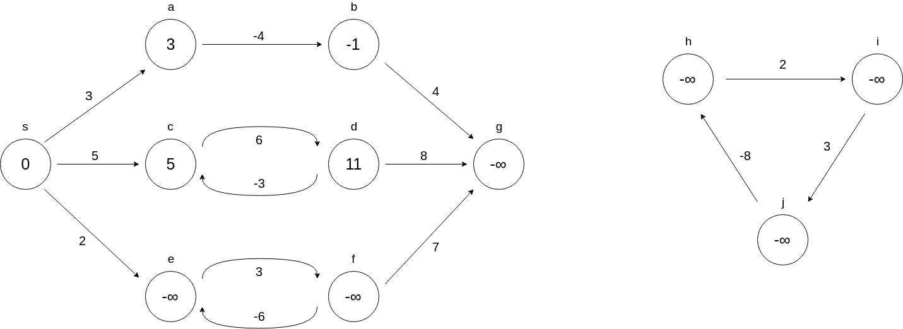
</p>
</div>

Algorithms like ***Dijkstra*** assume that all edge weights are non-negative. The ***Bellman-Ford*** algorithm, for example, allow negative weight edges in the input graph, as long as no negative weight cycles are reachable from the source. Typically, if there is such a negative-weight cycle, the algorithm can detect and report its existence.

###### Relaxation

Most algorithms use a technique called ***relaxation***. For each vertex <i>v &in; V</i>, we maintain an attribute <i>v.d</i>, which is an upper bound on the weight of the shortest path from source *s* to *v*. This process consists of testing whether we can improve the shortest path to *v* found so far by going through *u*, and, if so, updating the *v.d* and *v.π*. A relaxation step may decrease the value of a shortest-path estimate *v.d* and update *v's* predecessor *v.π*. 

<div>
<p align="center">
  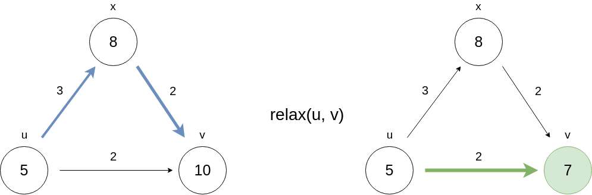
</p>
</div>

The image above shows a relaxation of the edge *(u, v)*, updating *v's* shortest-path estimate to 7 and its predecessor to *u*. We can perform a relaxation step in *constant* time. Moreover we have to initialize each vertex estimated value to **infinite** and its predecessor to **null**. 

To prove that the next algorithms are correct, we can define several properties of shortest paths and relaxation. 

- ***Triangle inequality:*** For any edge <i>(u, v) &in; E</i>, we have that <i>&delta;(s, v) &le; &delta;(s, u) + w(u, v)</i>. 
- ***Upper bound property:*** We always have <i>v.d &ge; &delta;(s, v)</i> for all vertices <i>v &in; V</i>. Once <i>v.d</i> achieves the <i>&delta;(s, v)</i> value, it never changes.
- ***No-path property:*** If there is no path from *s* to *v*, then we always have that <i>v.d = v.π = ∞</i>.
- ***Convergence property:*** If a path from *s* to edge <i>(u, v) &in; E</i> is a shortest path, and if <i>u.d = &delta;(s, u)</i> at any time prior relaxing edge <i>(u, v)</i>, then <i>u.d = &delta;(s, v)</i> at all times afterwards.
- ***Path-relaxation property:*** If <i>p = {v<sub>0</sub>, v<sub>1</sub> ... v<sub>k</sub>}</i> is a shortest path from <i>s = v<sub>0</sub></i> to <i>v<sub>k</sub></i>, and we relax the edges of *p* in the order <i>(v<sub>0</sub>, v<sub>1</sub>), (v<sub>1</sub>, v<sub>2</sub>) ... (v<sub>k - 1</sub>, v<sub>k</sub>)</i> then <i>v<sub>k</sub>.d = &delta;(s, v<sub>k</sub>)</i>.
- ***Predecessor-subgraph property:*** Once <i>v.d = &delta;(s, v)</i> for all <i>v &in; V</i>, the predecessor subgraph is a shortest-paths tree rooted at *s*.  

###### Bellman-Ford

This algorithm solves the single-source shortest-paths problem. Given a weighted, directed graph <i>G = (V, E)</i>, it returns a boolean value indicating whether or not there is a negative-weight cycle that is reachable from the source vertex. If there is such a cycle, then no solution exists. If there is no such cycle, teh algorithm calculates the shortest paths and their weights. 

The algorithm relaxes edges progressively decreasing the estimated value <i>v.d</i> of each vertex. Therefore, it decreases the weight of a shortest path from the source <i>s</i> to each vertex <i>v &in; V</i> until it achieves the actual shortest path weight <i>&delta;(s, v)</i>. 

```
BellmanFord(G):
  initializeSingleSource(G)
  for i = 1 to |G.V| - 1:
   for each edge (u, v) in G.E
    relax(u, v)
  for each edge (u, v) in G.E
    if v.d > u.d + w(u, v)
      return false
  return true
```

After initializing the *d* and *π* values for all vertices, the algorithm makes <i>|V| - 1</i> passes over the edges of the graph. Therefore this algorithm runs in ***O(VE)*** time.  

<div>
<p align="center">
  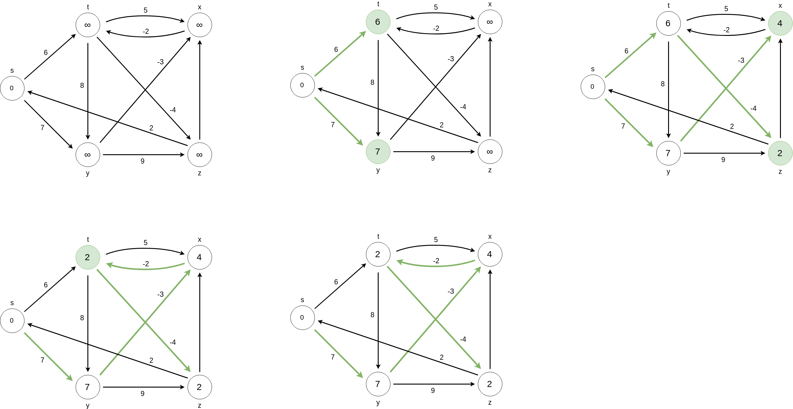
</p>
</div>

We can see an execution of the ***Bellman-Ford*** on a fairly simple graph in the picture above. Let us prove that the Bellman-Ford algorithm produces a correct result:

***Theorem:*** Let <i>G = (V, E)</i> be a weighted, directed graph with source *s*, and assume that <i>G</i> contains no negative-weight cycles that are reachable from <i>s</i>. Then, after the <i>|V| - 1</i> interations we have that <i>v.d = &delta;(s, v)</i> for all vertices *v* that are reachable from *s*.

***Proof:*** We can appeal to the path-relaxation property. Considering any vertex *v* that is reachable from *s*, and let <i>p = {v<sub>0</sub>, v<sub>1</sub> ... v<sub>k</sub>}</i>, where <i>v<sub>0</sub> = s</i> and <i>v<sub>k</sub> = v</i>, be any shortest path from *s* to *v*. Each of the <i>|V| - 1</i> iterations relaxes all <i>|E|</i> edges. By the path-relaxation property, we have that <i>v.d = v<sub>k</sub>.d = &delta;(s, v<sub>k</sub>) = &delta;(s, v)</i>.

###### Dijkstra

This algorithm solves the single-source shortest-paths problem on a weighted and directed graph <i>G = (V, E)</i>, for the case in which all edge weights are non negative. With a good implementation, we can achieve a lower running time than the one seen on the previous algorithm (Bellman-Ford). 

Dijkstra's maintains a set *S* of vertices whose final shortest-path weights from the source *s* have already been determined. The algorithm repeatedly selects the vertex that is not in *S* with the minimum shortest path estimate. It then adds the vertex to *S* and relaxes all edges leaving that vertex. In order to determine which vertex has a smaller estimate we use a ***minimum priority queue*** *Q*: 

```
Dijkstra(G):
  initializeSingleSource(G)
  S = {}
  Q = G.V
  while Q != {}:
    u = extractMin(Q)
    S = S U { u }
    for each edge (u, v) leaving u:
      relax(u, v)
```

Notice that Dijkstra is a greedy algorithm, it chooses to relax edges leaving vertexes whose weight is lower than any other vertex. We can see a run of this algorithm below.

<div>
<p align="center">
  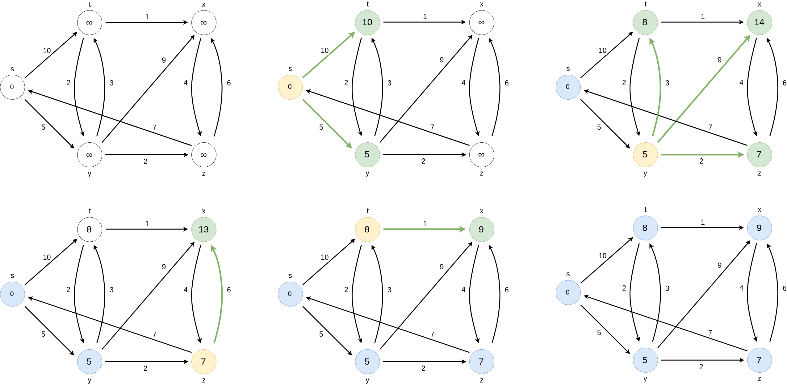
</p>
</div>

Even thought that greedy algorithms don't always compute optimal results, we can prove that this algorithm does indeed compute shortest paths.

***Theorem:*** Dijkstra's algorithm, run on a weighted and directed graph <i>G = (V, E)</i> with non-negative weights, terminates with <i>u.d = &delta;(s, u)</i> for all vertices <i>u &in; V</i>. 

***Proof:*** It suffices to show that for each vertex <i>u &in; V</i>, we have <i>u.d = &delta;(s, u)</i> at the time when *u* is added to the set *S*. We can then say that this conditions holds at all times thereafter. We claim that <i>y.d = &delta;(s, y)</i> when *y* is added to the set *S*. To prove this claim lets say we have an <i>x &in; S</i>. Because we choose *u* as the first vertex for which <i>u.d &ne; &delta;(s, u)</i> we had <i>x.d = &delta;(s, x)</i> when *x* was added to *S*. Edge *(x, y)* was relaxed and therefore this claim follows from the convergence property. We can prove by contradiction that <i>u.d = &delta;(s, u)</i>. 

In this algorithm we maintain a priority queue, and we might call three operations on this data structure: `insert`, `extractMin` and `decreaseKey`. We call `insert` and `extractMin` once per vertex. Since the total number of edges is *|E|*, we call the `decreaseKey` method at most |E| times. Thus the running time of this algorithm is strongly connected on how we implement this data structure. We can achieve a running time of ***O(V log V + E)*** if we use a ***Fibonacci heap*** . The amortized cost of calling `extractMin` is *O(log V)* and each `decreaseKey` call takes constant time amortized. 

If we use a *Binary heap* on the other hand, we end up with a higher running time. The `decreaseKey` method takes logarithmic time with this data structure. And therefore, the best we can do is <i>O(V<sup>2</sup>)</i>.


#### Karatsuba Algorithm

Karatsuba discovered an algorithm to multiply two numbers in linear time. The traditional multiplication algorithm takes <i>Θ(n<sup>2</sup>)</i> time. 

<div>
<p align="center">
  
</p>
</div>

Karatsuba defines ***x*** and ***y*** (numbers to be multiplied) by splitting them into 2 equal halfs:

- <i>x = x<sub>1</sub> &times; r<sup>n/2</sup> + x<sub>0</sub></i>
- <i>y = y<sub>1</sub> &times; r<sup>n/2</sup> + y<sub>0</sub></i>

With ***r*** denoting the radix of the number representation, and ***n*** the number of digits used to represent the number (digits in a word), <b>x<sub>1</sub></b> represents the higher half of <b>x</b> and <b>x<sub>0</sub></b> represents the lower half of <b>x</b>. Similarly, <b>y<sub>1</sub></b> represents the higher half of <b>y</b> and <b>y<sub>0</sub></b> represents the lower half of <b>y</b>. We could obtain the multiplication result by defining ***z***:

<div>
<p align="center">
  let <b>z<sub>0</sub></b> = x<sub>0</sub> &times; y<sub>0</sub>, <b>z<sub>2</sub></b> = x<sub>1</sub> &times; y<sub>1</sub>,  <b>z<sub>1</sub></b> = (x<sub>0</sub> &times; y<sub>1</sub>) + (x<sub>1</sub> &times; y<sub>0</sub>)
  <br>
  z = x &times; y = z<sub>0</sub> + z<sub>1</sub> + z<sub>2</sub>
</p>
</div>

Assuming that we can perform ***addition*** in linear time, we can define the recurrence tree for calculating ***z*** as:

<div>
<p align="center">
  T(n) = 4 &times; T(n/2) + Θ(n) = Θ(n<sup>2</sup>)
</p>
</div>

Therefore we can redefine <i>z<sub>1</sub></i> to be:

<div>
<p align="center">
  z<sub>1</sub> = (x<sub>0</sub> + x<sub>1</sub>) &times; (y<sub>0</sub> + y<sub>1</sub>) - <b>z<sub>0</sub></b> - <b>z<sub>1</sub></b> =  
</p>
</div>

Hence, we have now three multiplications instead of four in the previous method, our recurrence tree is now defined by:

<div>
<p align="center">
  T(n) = 3 &times; T(n/2) + Θ(n) 
  <br>
  T(n) = Θ(n<sup>log 3</sup>) = Θ(n<sup>1.58</sup>)
</p>
</div>

#### Minimax

This algorithm is a **decision-making** algorithm, typically used in a turn-based, two player games. The goal of the algorithm is to find the optimal next move. Hence, one player can be called the *maximizer* and one player can be called the *minimizer*. If we assign an evaluation score to the game board, one player tries to choose the game state with the maximum score, while the other chooses the state with the minimum score. An increase in one player's score results into a decrease in the other player score. 

The goal is to find the best move for the player. To do so, we can just choose the node with the best evaluation score. To make the process smarter, we can look ahead and evaluate potential opponent's moves. Evaluating the current state (root), we evaluate nodes based on their evaluation scores. 

Considering the tree below:

<div>
<p align="center">
  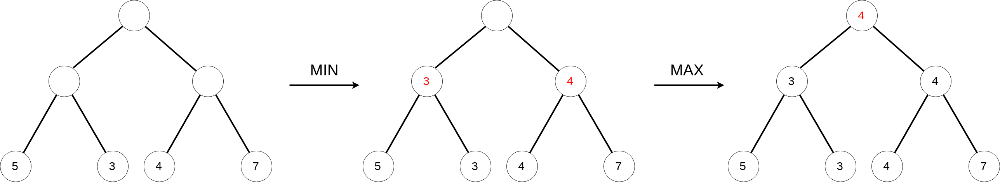
</p>
</div>

We can pass through the whole decision tree first, knowing which moves makes more sense in a given game state. If it is not feasible to construct the entire game tree, we can develop a partial tree, (defining an acceptable depth value for example). There's also an option to find the optimal move without the need of exploring every node of the game tree. By following some rules, we can skip some branches without affecting the final result. This process is called pruning, hence the ***Alpha-Beta pruning*** is an important variant of the minimax algorithm.

#### NP-Completeness

We can start by formalizing our notion of polynomial-time solvable problems. First we assume that if a problem requires time <i>Θ(n<sup>100</sup>)</i>, it is likely that a more efficient algorithm is discovered. Experience has shown that once the first polynomial-time algorithm for a problem has been discovered, more efficient algorithms often follow. Second, for any reasonable computational problem, if a problem can be solved in polynomial time, then it can be solved in polynomial time for any other model. Third, polynomial problems have nice closure properties, since polynomials are closed under adition, multiplication and composition. For example, if the output of one polynomial time was fed into the input of a different polynomial time, the overall resulting algorithm would still be polynomial.  

To understand the class of a *polynomial-time problem* we must first define what a *problem* is. We define an ***abstract problem*** Q to be the binary relation on a set ***I*** of problem ***instances*** and a set ***S*** of ***problem solutions***. This formulation is perhaps more general than what we need for our purposes. The theory of NP-completeness restricts attention to ***decision problems***, those having a yes/no solution. In this case, we can view an abstract decision problem as a function that maps the instance set ***I*** to the solution set <i>{0, 1}</i>. Many abstract problems are not decision problems, but rather ***optimization problems***, which requires some value to be minimized/maximized. However, we can usually recats an optimization problem as a decision problem that is no harder. 

In order for a computer to solve abstract problems, we must represent problem instances in a way that a program understands. An ***enconding*** of a set *S* of abstract objects is a mapping *e* from *S* to the set of binary strings. Taking as an example the set of natural numbers <i>&#8469; = {0, 1, 2, 3, 4 ... }</i> as the strings <i>{ 0, 1, 10, 11, 100 ... }</i>. We can encode a compound object as a binary string by combining the representation of its constituent parts. Thus, a computer algorithm that solves an abstract decision problem takes an enconding of a problem instance as input. We call this kind of problems ***concrete problems***. A ***concrete problem*** is ***polynomial-time solvable*** if an algorithm to solve it in <i>O(n<sup>k</sup>)</i> exists, for some constant *k*. Therefore, we can define the class ***P*** to be the set of concrete decision problems that are polynomial-time solvable. 


The ***complexity class NP*** is the class of languages that can be verified in polynomial time. It is known that <i>P &sube; NP</i>, but it is unknown whether <i>P = NP</i>. Nevertheless, most researchers believe that P and NP are not the same class. Intuitively, the class P consists of problems that can be solved quickly. The class NP consists of problem that can be verified quickly. 

Perhaps the most compelling reason why theoretical computer scientists believe that <i>P &dif; NP</i> comes from the existence of the class of "NP-complete" problems. This class has a property that states that if any *NP-complete* problem can be solved in polynomial time, then every problem in NP can be solved in polynomial time, and so *P = NP*. The *NP-complete* languages are the hardest languages in *NP*. 


Intuitively, a problem *Q* can be ***reduced*** to another problem *Q'* if any instance of *Q* can be easily rephrased as an instance of *Q'*. Thus, if a problem *Q* reduces to a problem *Q'*, then *Q* is no harder to solve than *Q'*. We say that the language <i>L<sub>1</sub></i> is polynomial-time reducible to to a language <i>L<sub>2</sub></i> if there exists a polynomial-time computable function such as: <i>f : {0, 1} &rarr; {0, 1}</i> such that for all <i>x &in; {0, 1}</i>. We call *f* the ***reduction function***, and a polynomial time algorithm *F* that computes *f* the ***reduction algorithm***.  Polynomial-time reductions provide a formal means for showing that one problem is at least as hard as another, to within a polynomial-time factor. A language <i>L &sube; {0, 1}</i> is ***NP-complete*** if

1. <i> L &in; NP</i>
2. L' is polynomial reducible for every <i>L &in; NP</i>

If a language satisfies property 2, but not necessarily property 1, then we say that *L* is ***NP-hard***.  

The following diagram defines these classes in a "more visual" way.

<div>
<p align="center">
  
</p>
</div>

